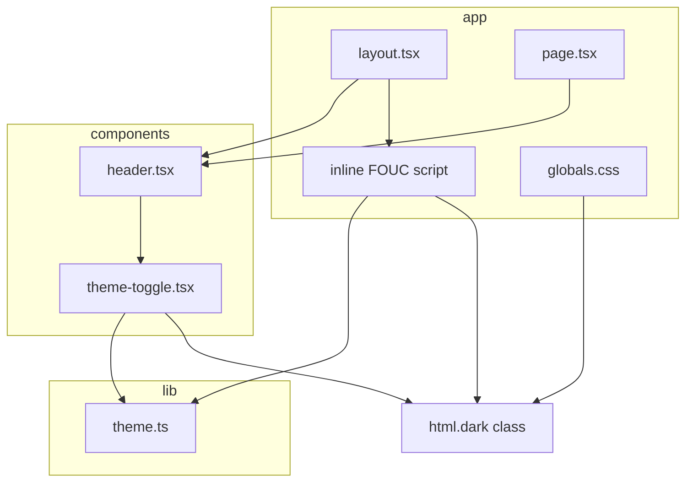
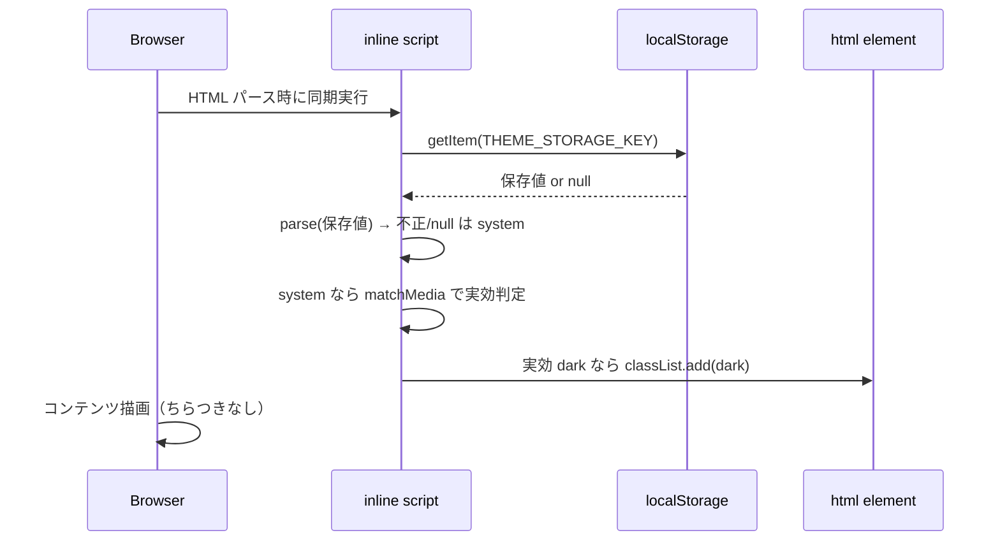
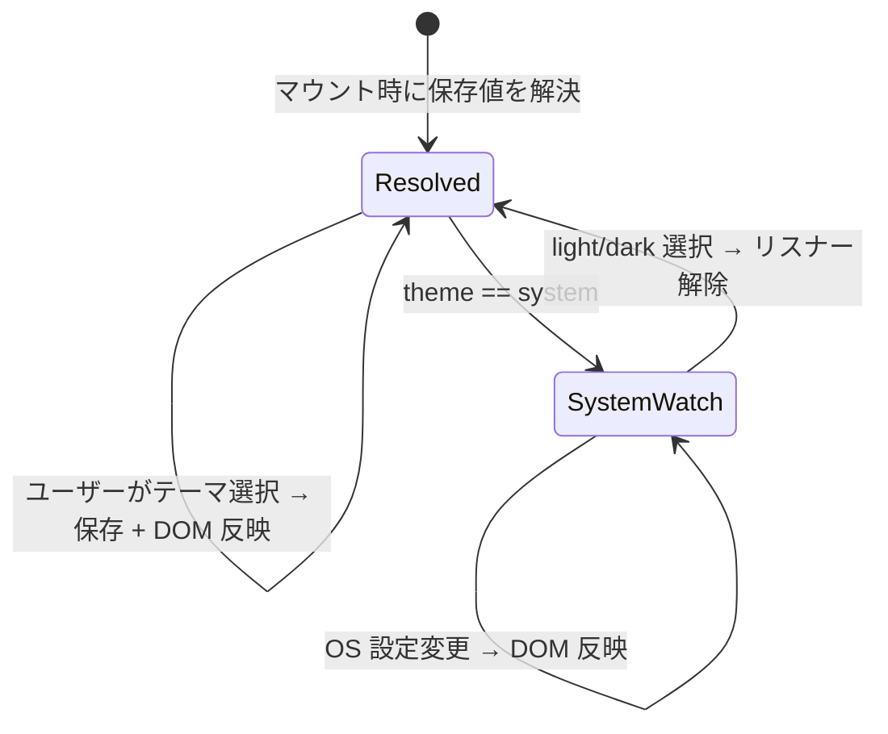

# Technical Design: theme-toggle

## Overview

本機能は、サイト閲覧者が配色テーマを **ライト / ダーク / システム** の3択で明示的に選択できる切替 UI を提供する。選択は同一ブラウザ内に永続化され、再訪時に復元される。既定は「システム」（OS 設定追従）。

**Users**: サイト閲覧者（作者本人）がヘッダー右上のトグルから操作する。

**Impact**: 現状テーマは `@media (prefers-color-scheme: dark)` による OS 追従のみ。本機能で Tailwind の dark バリアントを **class ベース**（`.dark`）へ移行し、`<html>` への `.dark` クラス付与を単一の真実源として、手動選択・OS 追従・FOUC 回避を実現する。

### Goals
- ライト/ダーク/システムの3択を提供し、再読み込みなしで即時反映する（Req 1）。
- 選択を同一ブラウザ内に永続化し、再訪時に復元。不正・未保存時は「システム」へフォールバック（Req 2）。
- 初期表示で FOUC を発生させない（Req 3）。
- 「システム」選択時のみ OS 設定変更にリアルタイム追従する（Req 4）。
- ヘッダー右上に配置し、現在選択を可視化、キーボード操作可能（Req 5）。

### Non-Goals
- 新規カラーパレット/デザインシステムの策定（既存の背景・前景変数の枠内で対応）。
- セピア等の追加テーマ、サーバー側（Cookie/DB）永続化、複数端末同期。
- 記事収集パイプライン・記事表示ロジックへの変更。

## Boundary Commitments

### This Spec Owns
- テーマモデル（`Theme` 型）と純粋ヘルパー（選択値の検証・既定フォールバック・実効テーマ解決）。
- テーマ選択 UI（`ThemeToggle` Client Component）とその状態・永続化・OS 追従購読。
- `<html>` への `.dark` クラス適用の規約（トグルと FOUC スクリプトが従う単一の DOM 操作）。
- Tailwind の class ベースダークモード基盤（`globals.css` の `@custom-variant` と変数セレクタ移行）。

### Out of Boundary
- 個々のコンポーネントの配色デザインそのもの（本機能は「切替の仕組み」を提供し、各コンポーネントの `dark:` 配色値は所有しない）。
- ヘッダーのレイアウト/既存表示要素（記事件数等）の仕様。
- サーバー側レンダリングのデータ取得ロジック。

### Allowed Dependencies
- `lib/theme.ts`（新規・本スペック所有）。
- 既存 `globals.css` の CSS 変数（`--background` / `--foreground`）。
- 既存 `header.tsx`（トグルの差し込み先としてのみ）。
- ブラウザ API: `localStorage`、`matchMedia`、`document.documentElement.classList`。

### Revalidation Triggers
- `Theme` 型の値集合（`"light" | "dark" | "system"`）の変更。
- `THEME_STORAGE_KEY` の変更（FOUC スクリプトとの突合が必要）。
- `.dark` クラスを真実源とする規約の変更。
- 配色変数（`--background` / `--foreground`）の名称・責務変更。

## Architecture

### Existing Architecture Analysis
- 層構成は app → components → lib（steering `structure.md`）。ドメインロジックは `lib/` に集約、components はステートレス消費者。
- 既存 Client Component パターン: `source-tabs.tsx`（`"use client"` + `useState` + `role`/`aria-*` + `data-testid`）。
- 既存 lib ヘルパーパターン: `source-tabs-utils.ts`（型 + 定数 + 純粋関数、`.test.ts` 併置）。
- 現状 `globals.css` は `@media (prefers-color-scheme: dark)` で `:root` 変数を切替（class ベース未導入）。

### Architecture Pattern & Boundary Map



**Architecture Integration**:
- Selected pattern: 既存のレイヤード構成を踏襲。テーマロジックを `lib/theme.ts` に集約し、`ThemeToggle` は消費者に徹する。
- Domain/feature boundaries: 純粋ロジック（lib）／ UI と副作用（component）／ 初期化（FOUC スクリプト）／ スタイル基盤（globals.css）を分離。
- Existing patterns preserved: kebab-case ファイル名、`dark:` ユーティリティ、`data-testid`、テスト併置、`@/` 絶対インポート。
- New components rationale: `theme.ts`（テスト可能な純粋ロジック）と `theme-toggle.tsx`（クライアント状態）は責務が異なるため分離。
- Dependency direction: app → components → lib。FOUC スクリプトは lib のロジックと**値の一致**を保つ（import 不可のため規約で担保）。

### Technology Stack

| Layer | Choice / Version | Role in Feature | Notes |
|-------|------------------|-----------------|-------|
| Frontend | Next.js 16.2.4 / React 19.2.4 | layout のインラインスクリプト・Client Component トグル | `<html suppressHydrationWarning>` 必須 |
| Styling | Tailwind CSS 4.2.4 | class ベースダークモード | `@custom-variant dark (&:where(.dark, .dark *));` |
| Persistence | ブラウザ `localStorage` | 選択値の永続化 | try/catch でガード、不在時は既定へ |
| Runtime API | `matchMedia` | OS カラースキーム検知・変更購読 | system 選択時のみリスナー登録 |

## File Structure Plan

### New Files
```
next/
├── lib/
│   ├── theme.ts             # Theme 型・THEME_OPTIONS・THEME_STORAGE_KEY・parseTheme・resolveEffectiveTheme（純粋）
│   ├── theme.test.ts        # parseTheme / resolveEffectiveTheme の単体テスト
│   └── theme.pbt.test.ts    # parseTheme の入力検証プロパティテスト（任意入力→必ず有効 Theme）
└── components/
    ├── theme-toggle.tsx      # "use client" 切替 UI（状態・永続化・matchMedia 購読・DOM 反映）
    └── theme-toggle.test.tsx # トグルの描画・選択・aria 状態テスト
```

### Modified Files
- `next/app/globals.css` — `@import "tailwindcss";` 直後に `@custom-variant dark (&:where(.dark, .dark *));` を追加。`@media (prefers-color-scheme: dark) { :root {...} }` を `.dark { --background: #0a0a0a; --foreground: #ededed; }` セレクタへ書き換え。
- `next/app/layout.tsx` — `<html>` に `suppressHydrationWarning` を付与。`<body>` 直前に素の `<script dangerouslySetInnerHTML>` を配置し、`THEME_STORAGE_KEY` から保存値を読み、`parseTheme` 相当のロジックで実効テーマを判定して `.dark` クラスを初期付与。
- `next/components/header.tsx` — 右側に `<ThemeToggle />` を差し込む（既存の記事件数表示と併置、レイアウト調整）。

## Requirements Traceability

| Requirement | Summary | Components | Interfaces | Flows |
|-------------|---------|------------|------------|-------|
| 1.1 | 3択を提供 | theme-toggle.tsx, theme.ts | `THEME_OPTIONS` | 選択フロー |
| 1.2–1.4 | ライト/ダーク/システムを反映 | theme-toggle.tsx, globals.css | `applyTheme`（DOM 反映）, `resolveEffectiveTheme` | 選択フロー |
| 1.5 | 再読み込みなし即時反映 | theme-toggle.tsx | `classList` 操作 | 選択フロー |
| 2.1 | 選択を永続化 | theme-toggle.tsx | `localStorage.setItem` | 選択フロー |
| 2.2 | 再訪時に復元・適用 | layout.tsx(FOUC), theme-toggle.tsx | FOUC script, `localStorage.getItem` | 初期化フロー |
| 2.3 | 未保存時は既定 system | theme.ts | `parseTheme` | 初期化フロー |
| 2.4 | 不正値は無視し system | theme.ts | `parseTheme` | 初期化フロー |
| 3.1–3.2 | FOUC 回避 | layout.tsx(FOUC script) | inline blocking script | 初期化フロー |
| 4.1 | system 時 OS 追従 | theme-toggle.tsx | `matchMedia` change 購読 | OS 追従フロー |
| 4.2 | light/dark 固定時は不変 | theme-toggle.tsx, theme.ts | `resolveEffectiveTheme` | OS 追従フロー |
| 5.1 | ヘッダー右上に配置 | header.tsx | JSX 配置 | — |
| 5.2 | 現在選択を可視化 | theme-toggle.tsx | `aria-pressed`/`aria-checked` | — |
| 5.3 | キーボード操作可 | theme-toggle.tsx | ネイティブ `<button>` | — |

## System Flows

### 初期化フロー（FOUC 回避）


### 選択 / OS 追従フロー


## Components and Interfaces

| Component | Domain/Layer | Intent | Req Coverage | Key Dependencies | Contracts |
|-----------|--------------|--------|--------------|------------------|-----------|
| theme.ts | lib | テーマ型と純粋ヘルパー | 1.1, 2.3, 2.4, 4.2 | なし | State(型/定数) |
| theme-toggle.tsx | components | 切替 UI・状態・副作用 | 1.*, 2.1, 4.*, 5.2, 5.3 | theme.ts (P0) | State |
| FOUC script (layout.tsx) | app | 初期テーマ適用 | 2.2, 3.1, 3.2 | theme.ts と値一致 (P0) | — |
| header.tsx | components | トグルの配置 | 5.1 | theme-toggle.tsx (P1) | — |
| globals.css | app | class ベースダーク基盤 | 1.2–1.4 | — | — |

### lib

#### theme.ts

| Field | Detail |
|-------|--------|
| Intent | テーマの型・定数・純粋ヘルパーを集約 |
| Requirements | 1.1, 2.3, 2.4, 4.2 |

**Responsibilities & Constraints**
- `Theme` 型と選択肢・保存キーの単一定義。
- 任意入力を必ず有効な `Theme` に正規化（副作用なし・純粋）。
- `theme` と OS 設定から実効テーマ（`"light" | "dark"`）を決定。
- 制約: ブラウザ API に依存しない純粋関数（OS 設定は引数で受ける）。`localStorage` アクセスは行わない（component 側の責務）。

**Dependencies**
- Outbound: なし
- External: なし

**Contracts**: State [x]

##### State Management
```typescript
export type Theme = "light" | "dark" | "system";
export type EffectiveTheme = "light" | "dark";

export const THEME_OPTIONS: readonly Theme[] = ["light", "dark", "system"] as const;
export const THEME_STORAGE_KEY = "theme";

/** 任意入力を有効な Theme に正規化。不正・null は "system"（既定）。 */
export function parseTheme(value: string | null | undefined): Theme;

/** theme と OS のダーク選好から実効テーマを決定。 */
export function resolveEffectiveTheme(theme: Theme, prefersDark: boolean): EffectiveTheme;
```
- Preconditions: なし（任意入力を受理）。
- Postconditions: `parseTheme` の戻り値は必ず `THEME_OPTIONS` のいずれか。`resolveEffectiveTheme` は `theme==="system"` のとき `prefersDark` に従い、それ以外は `theme` をそのまま実効値とする。
- Invariants: 純粋・参照透過。

### components

#### theme-toggle.tsx

| Field | Detail |
|-------|--------|
| Intent | 3択トグル UI、選択の永続化、DOM 反映、system 時の OS 追従購読 |
| Requirements | 1.1–1.5, 2.1, 4.1, 4.2, 5.2, 5.3 |

**Responsibilities & Constraints**
- `THEME_OPTIONS` を `<button>` 群として描画し、現在選択を `aria` 状態で可視化。
- 選択時: `localStorage.setItem(THEME_STORAGE_KEY, theme)` ＋ 実効テーマを `<html>` の `.dark` クラスへ反映。
- マウント時: `localStorage` 値を `parseTheme` で解決し state を初期化（FOUC スクリプトが既に DOM に適用済みのため、ここでの DOM 操作は冪等）。
- `theme === "system"` のとき `matchMedia("(prefers-color-scheme: dark)")` の `change` を購読し DOM 反映。`useEffect` の cleanup で必ず解除。light/dark 選択時は購読しない（4.2）。
- 制約: ネイティブ `<button>` を用いキーボード操作を担保（5.3）。`localStorage`/`matchMedia` アクセスは try/catch でガード。

**Dependencies**
- Outbound: `lib/theme.ts` — 型・定数・`parseTheme`・`resolveEffectiveTheme`（P0）
- External: `localStorage`, `matchMedia`, `document.documentElement.classList`（P0）

**Contracts**: State [x]

##### State Management
- State model: `const [theme, setTheme] = useState<Theme>(...)`。初期値はマウント後に `localStorage` から解決（SSR 整合のため初期レンダリングは既定→`useEffect` で同期、`suppressHydrationWarning` は `<html>` 側で担保）。
- Persistence: `localStorage`（同一ブラウザ）。
- Concurrency: 単一クライアント、競合なし。

**Implementation Notes**
- Integration: `applyTheme(theme)` ヘルパー（`resolveEffectiveTheme` + `classList.toggle("dark", ...)`）を内部に持つ。トグルと初期同期で共用。
- Validation: 復元値は `parseTheme` で必ず正規化。
- Risks: FOUC スクリプトと初期状態の二重適用 → DOM 操作を冪等化して回避。

#### header.tsx（変更）
- Intent: 既存ヘッダー右側に `<ThemeToggle />` を配置（5.1）。記事件数表示と併置できるようレイアウト調整。
- Implementation Note: プレゼンテーションのみ。新たな境界は持たない。

### app

#### FOUC script（layout.tsx 内インライン）
- Intent: ハイドレーション前に保存テーマを解決し `.dark` を初期付与（2.2, 3.1, 3.2）。
- Implementation Note:
  - Integration: `<body>` 直前に素の `<script dangerouslySetInnerHTML>`。`<html suppressHydrationWarning>` 必須。
  - Validation: `localStorage` を try/catch で読み、不正/null は system 扱い。system は `matchMedia` で実効判定。
  - Risks: `lib/theme.ts` の `THEME_STORAGE_KEY` と正規化規則からドリフトしうる → 同一値・同一規則を維持（Revalidation Trigger）。スクリプトは import 不可のため自己完結 JS。

#### globals.css（変更）
- Intent: class ベースダークモード基盤（1.2–1.4）。
- Implementation Note: `@custom-variant dark (&:where(.dark, .dark *));` を追加し、`@media (prefers-color-scheme: dark)` の変数定義を `.dark` セレクタへ移行。これにより `.dark` クラス1つで `dark:` ユーティリティと CSS 変数の双方が切替わる。

## Error Handling

### Error Strategy
- **`localStorage` 例外**（プライベートモード・無効化）: 読み書きを try/catch でガードし、失敗時は既定「システム」へフォールバック（2.3 と整合）。永続化失敗してもセッション内の切替は機能する。
- **不正・未知の保存値**: `parseTheme` が「システム」へ正規化（2.4）。
- **`matchMedia` 非対応**: 取得失敗時はライト扱い（フォールバック）し、例外を投げない。

## Testing Strategy

### Unit Tests（`lib/theme.test.ts`）
- `parseTheme("light"|"dark"|"system")` がそれぞれ自身を返す（1.1）。
- `parseTheme(null)` / `parseTheme(undefined)` / `parseTheme("")` が `"system"` を返す（2.3）。
- `parseTheme("invalid")` など未知値が `"system"` を返す（2.4）。
- `resolveEffectiveTheme("system", true)→"dark"`、`("system", false)→"light"`（4.1）。
- `resolveEffectiveTheme("light", true)→"light"`、`("dark", false)→"dark"`（固定は OS 非依存、4.2）。

### Property-Based Tests（`lib/theme.pbt.test.ts`）
- 任意文字列入力に対し `parseTheme` の戻り値が必ず `THEME_OPTIONS` のいずれか（2.4・全域性）。

### Component Tests（`components/theme-toggle.test.tsx`）
- 3つの選択肢が描画される（1.1）。
- 選択した項目が `aria` 状態で現在選択として示される（5.2）。
- 選択時に `localStorage` へ保存され、`<html>` の `.dark` クラスが期待どおり切替わる（1.2–1.5, 2.1）。

### E2E Tests（`e2e/`）
- ダーク選択 → リロード後もダークが維持される（2.1, 2.2）。
- 初期表示でちらつき（誤配色→正配色）が起きない（3.1, 3.2）。
