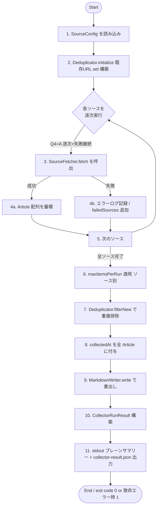

# Business Logic Model — Unit 1 (Collector)

**Project**: news.hako.tokyo
**Stage**: CONSTRUCTION — Functional Design
**Created**: 2026-04-25

このドキュメントは Unit 1 (Collector) の **詳細なビジネスロジック・ワークフロー・データ変換アルゴリズム** を技術非依存で定義します。コード実装は Code Generation で行います。

---

## 1. 主要なワークフロー

### 1.1 CollectorRunner.run() のステップ詳細



### Text Alternative
1. `SourceConfig` を読込み (TypeScript module から default export)
2. `Deduplicator.initialize()` で既存 `content/*.md` の frontmatter から URL set を構築 (正規化済み)
3〜5. 各 `SourceFetcher` を **逐次** 実行。成功時は Article を蓄積、失敗時はログ + `failedSources` に追加して **次へ継続** (Q4=A)
6. ソース別に `maxItemsPerRun` で切り詰め (Q9=A)
7. `Deduplicator.filterNew()` で URL ベース重複を除外 (Q5=B 軽い正規化)
8. 残った Article に `collectedAt` (現在時刻 ISO 8601) を付与
9. `MarkdownWriter.write()` で `content/` に書出し
10〜11. `CollectorRunResult` を構築し、stdout プレーンサマリー + `collector-result.json` 出力 (Q6=C)

### 1.2 CollectorRunner の擬似コード (アルゴリズム)

```pseudocode
function run():
    startTime = now()
    config = loadSourceConfig()
    dedup = new Deduplicator(contentDir)
    await dedup.initialize()  // 既存 URL を読み込む

    allFetched = []
    failedSources = []
    perSourceCount = {}

    for fetcher in fetchers:  // 逐次 (Q4=A)
        if not config[fetcher.source].enabled:
            log({level: "info", source: fetcher.source, message: "disabled, skipping"})
            continue
        try:
            articles = await fetcher.fetch(config[fetcher.source])
            // ソース別 maxItemsPerRun 適用 (Q9=A)
            limited = articles.slice(0, config[fetcher.source].maxItemsPerRun)
            allFetched.push(...limited)
            perSourceCount[fetcher.source] = limited.length
            log({level: "info", source: fetcher.source, message: "fetched", count: limited.length})
        catch err:
            failedSources.push(fetcher.source)
            log({level: "error", source: fetcher.source, message: "fetch failed", error: err.message})
            // 失敗継続 (Q4=A)

    newArticles = dedup.filterNew(allFetched)  // URL 軽い正規化 + 重複除外

    nowIso = isoNow()
    stamped = newArticles.map(a => ({...a, collectedAt: nowIso}))

    writeResult = await markdownWriter.write(stamped)

    result = {
        totalFetched: allFetched.length,
        totalNew: writeResult.written,
        totalDuplicate: allFetched.length - newArticles.length,
        failedSources: failedSources,
        durationMs: now() - startTime,
    }

    emitPlainSummary(result)              // Q6=C: stdout プレーン
    writeJsonReport(result, perSourceCount) // Q6=C: collector-result.json

    return result
```

---

## 2. SourceFetcher 実装ごとのデータ変換ロジック

### 2.1 共通: RSS XML → Article のマッピング (Zenn / Hatena / GoogleNews 共通)

`rss-parser` (Q1=A) でパース後、各フィールドを以下のとおりマップします。

| Article フィールド | RSS / Atom 由来フィールド | 加工内容 |
|---|---|---|
| `id` | (URL から導出) | `generateArticleId(item.link)` (decimes-domain-entities §2.4 参照) |
| `title` | `item.title` | 前後空白トリム + 改行を半角空白に置換、最大 500 文字に切り詰め |
| `url` | `item.link` (Atom: `item.link[].href` で `rel=alternate`) | そのまま保存 (正規化前の値) |
| `source` | (固定) | 各 Adapter が固有値を埋める ("zenn"/"hatena"/"googlenews") |
| `publishedAt` | `item.isoDate` (rss-parser が pubDate / dc:date / published を ISO 8601 に変換) | パース失敗時は `now()` をフォールバック |
| `collectedAt` | (Adapter は埋めない、Runner が付与) | — |
| `summary` | `item.contentSnippet` または `item.content` の text 抽出 | HTML タグ除去 + 前後空白トリム + 最大 1000 文字切詰 |
| `tags` | `item.categories` (配列) | 各要素 trim、空文字除外 |
| `thumbnailUrl` | `item.enclosure.url` または `item["media:content"]?.["$"]?.url` または `item["media:thumbnail"]?.["$"]?.url` | 取得不能なら `null` |

### 2.2 ZennRssFetcher の特記事項

- 既定 feed URL: `https://zenn.dev/feed`
- 設定で複数 feed URL を扱える (`feedUrls: string[]`)
- 各 feed を **逐次** で取得 (1 つの Adapter 内では並列なし、レートリミット配慮)
- 失敗した feed URL は `console.warn` 相当で記録、他の feed URL は継続して処理
- 1 つの feed が失敗しただけで Adapter 全体を失敗にはしない (= Adapter 内でも失敗継続)

### 2.3 HatenaRssFetcher の特記事項

- 既定 feed URL: `https://b.hatena.ne.jp/hotentry/it.rss`
- はてなブックマークの RSS は **`<dc:date>`** で公開日時を提供 (rss-parser が `isoDate` で吸収)
- `<hatena:bookmarkcount>` などの拡張要素は **MVP では参照しない** (将来の拡張余地)
- カテゴリ別 RSS の追加 (例: 一般、世の中) は `feedUrls` 配列に追記するだけで対応

### 2.4 GoogleNewsRssFetcher の特記事項

#### URL 構築ロジック

```pseudocode
function buildUrls(config: GoogleNewsConfig): string[] {
    urls = []
    common = `hl=${config.hl}&gl=${config.gl}&ceid=${config.ceid}`
    for query in config.queries:
        urls.push(`https://news.google.com/rss/search?q=${encodeURIComponent(query)}&${common}`)
    for topic in config.topics:
        urls.push(`https://news.google.com/news/rss/headlines/section/topic/${topic}?${common}`)
    for geo in config.geos:
        urls.push(`https://news.google.com/news/rss/headlines/section/geo/${encodeURIComponent(geo)}?${common}`)
    return urls
}
```

#### マッピング上の注意点

- Google ニュース RSS の `<link>` は **Google News 経由のリダイレクト URL** (`https://news.google.com/articles/...`) を返すケースが多い。
  - **MVP の方針**: そのまま `Article.url` に保存する (利用者がクリックするとリダイレクトされ元記事に到達)
  - 将来的に元 URL を解決したい場合は HEAD リクエストで `Location` ヘッダを追跡する処理を追加可能 (本 Functional Design では実装しない)
- `<source url="...">` 属性で元媒体名を取得可能 → `Article.tags` に媒体名を 1 件追加してもよい (運用しながら判断、MVP では追加しない)
- 失敗 URL は他の URL の処理を継続 (Adapter 内でも失敗継続)

### 2.5 TogetterScraper の処理ロジック (Q7 = A: カテゴリ別人気まとめ)

#### 取得手順

```pseudocode
function fetch(config: TogetterConfig): Article[] {
    if not config.enabled: return []
    results = []
    for url in config.targetUrls:
        html = await httpClient.get(url, {
            headers: { "User-Agent": "news.hako.tokyo collector (umatoma)" }
        })
        items = parseTogetterCategoryPage(html)  // cheerio で抽出
        for item in items.slice(0, config.maxItemsPerRun):
            results.push(toArticle(item))
        await sleep(config.requestIntervalMs)  // レート制御
    return results
}
```

#### `parseTogetterCategoryPage()` の抽出ターゲット

カテゴリ別人気まとめページから以下を抽出 (cheerio セレクタは Code Generation で確定):
- まとめタイトル (anchor のテキスト)
- まとめ URL (anchor の href、相対パスなら絶対化)
- 公開日 / 更新日 (見つからない場合は HTTP レスポンスの `Date` ヘッダか `now()`)
- 概要文 (まとめ説明文があれば)
- サムネイル URL (まとめのサムネイル画像があれば)

#### Article へのマッピング

| Article フィールド | 取得元 |
|---|---|
| `id` | `generateArticleId(togetterUrl)` |
| `title` | まとめタイトル |
| `url` | まとめ URL (絶対化済み) |
| `source` | "togetter" 固定 |
| `publishedAt` | まとめページから取得できれば優先、不能なら `now()` |
| `summary` | まとめ概要文 (取得不能なら空文字) |
| `tags` | カテゴリ名 (例: "news") を 1 件、ページから取得できる関連タグがあれば追加 |
| `thumbnailUrl` | サムネイル URL or `null` |

#### レート制御
- リクエスト間隔: `requestIntervalMs` (デフォルト 5000ms)
- User-Agent を明示し、bot であることを示唆 (規約遵守)
- 失敗 (HTTP 4xx/5xx、HTML 構造の予期せぬ変化) はログ記録 + Adapter 失敗扱い

### 2.6 全 Adapter 共通: HttpClient 抽象

- HTTP GET のみ使用 (POST/PUT 等は不要)
- タイムアウト: 30 秒 (`HttpClient` 抽象で設定)
- リトライ: **MVP では行わない** (失敗継続戦略 Q4=A の方針に揃える、シンプルさ優先)
- エラー時は HttpClient が `Error` を throw → Adapter がキャッチして失敗扱い

---

## 3. Deduplicator のロジック

### 3.1 `initialize()`

```pseudocode
async function initialize() {
    files = await fileSystem.listMarkdownFiles(contentDir)
    urlSet = new Set()
    for filePath in files:
        text = await fileSystem.readText(filePath)
        fm = parseFrontmatter(text)
        validated = ArticleFrontmatterSchema.parse(fm)
        normalized = normalizeUrlForDedup(validated.url)
        urlSet.add(normalized)
    this.knownUrls = urlSet
}
```

- frontmatter パース失敗ファイルは **致命エラー** として throw (データ不整合は MVP では即時可視化)
- 既存 `content/*.md` 全件を対象にする

### 3.2 `filterNew(candidates)`

```pseudocode
function filterNew(candidates: Article[]): Article[] {
    seenInBatch = new Set()
    result = []
    for article in candidates:
        normalized = normalizeUrlForDedup(article.url)
        if knownUrls.has(normalized): continue       // 既存と重複
        if seenInBatch.has(normalized): continue     // バッチ内重複
        seenInBatch.add(normalized)
        result.push(article)
    return result
}
```

### 3.3 不変条件 (PBT-03 で検証)
- `output.length` ≤ `input.length`
- `output` 内の `normalizeUrlForDedup(article.url)` 全て一意
- `output` の各 URL は `knownUrls` に **含まれない**
- `input` 内に既知 URL を含まない記事 X があれば、`output` のいずれかと等しい (= 既知 URL でないものは除外されない、ただしバッチ内重複は最初の 1 件のみ残る)

---

## 4. MarkdownWriter のロジック

### 4.1 `write(articles)` の擬似コード

```pseudocode
async function write(articles: Article[]): WriteResult {
    written = 0
    skipped = 0
    for article in articles:
        date = article.publishedAt.slice(0, 10)  // "YYYY-MM-DD"
        slug = slugBuilder.build(article.title, article.id)
        baseFilename = `${date}-${slug}.md`
        filePath = path.join(contentDir, baseFilename)
        finalPath = await ensureUnique(filePath)  // 衝突時に -2.md, -3.md
        content = renderMarkdown(article)
        await fileSystem.ensureDir(contentDir)
        await fileSystem.writeText(finalPath, content)
        written += 1
    return { written, skipped }
}
```

### 4.2 `renderMarkdown(article)` の出力 (Q3 = B / Q8 = B)

```typescript
function renderMarkdown(article: Article): string {
  const fm = toFrontmatter(article);
  const yaml = stringifyYaml(fm);  // js-yaml 等
  return [
    "---",
    yaml.trimEnd(),
    "---",
    "",
    `# ${article.title}`,
    "",
    article.summary,
    "",
  ].join("\n");
}
```

- frontmatter は **snake_case YAML** (Q3=B)
- 本文は `# {title}` (H1) + 空行 + `summary` (Q8=B)
- `summary` が空文字の場合は H1 のみ書く (空行で終わる)

### 4.3 `ensureUnique(filePath)`

```pseudocode
async function ensureUnique(filePath: string): string {
    if not await fileSystem.exists(filePath): return filePath
    parsed = path.parse(filePath)  // dir, name, ext
    for n in 2..99:
        candidate = path.join(parsed.dir, `${parsed.name}-${n}${parsed.ext}`)
        if not await fileSystem.exists(candidate): return candidate
    throw new Error("filename collision exceeded retry limit")
}
```

---

## 5. ロギングとレポート

### 5.1 stdout プレーンサマリー (Q6 = C の B 部分)

```text
[INFO][collector] start
[INFO][zenn] disabled, skipping             (有効でない場合)
[INFO][zenn] fetched count=23
[INFO][hatena] fetched count=50
[ERROR][googlenews] fetch failed: ...
[INFO][togetter] fetched count=15
[INFO][collector] dedup candidates=88 new=42 duplicate=46
[INFO][collector] write written=42
[INFO][collector] done totalFetched=88 totalNew=42 totalDuplicate=46 failedSources=googlenews durationMs=12345
```

### 5.2 構造化レポート `collector-result.json` (Q6 = C の A 部分)

CollectorRunner 完了時にリポジトリルート (もしくは GitHub Actions Job 内一時ディレクトリ) に出力:

```json
{
  "schemaVersion": 1,
  "ranAt": "2026-04-25T22:05:12+09:00",
  "totalFetched": 88,
  "totalNew": 42,
  "totalDuplicate": 46,
  "failedSources": ["googlenews"],
  "perSource": {
    "zenn": { "fetched": 23, "skipped": false, "error": null },
    "hatena": { "fetched": 50, "skipped": false, "error": null },
    "googlenews": { "fetched": 0, "skipped": false, "error": "fetch failed: ..." },
    "togetter": { "fetched": 15, "skipped": false, "error": null }
  },
  "durationMs": 12345
}
```

- このファイルは **gitignore 対象** (実行毎に変動するため、Git で管理しない)
- GitHub Actions では artifact として upload して可視化可能 (Infrastructure Design で扱う)

---

## 6. PBT 適用先の確定

| Component | PBT Rule | 概要 |
|---|---|---|
| `toFrontmatter` / `fromFrontmatter` | PBT-02 | `fromFrontmatter(toFrontmatter(article))` = `article` |
| `normalizeUrlForDedup` | PBT-03 (Idempotency) | `n(n(x))` = `n(x)` (PBT-04 advisory に該当するが Partial では PBT-03 の不変条件として記述) |
| `Deduplicator.filterNew` | PBT-03 | 出力 URL 一意性 / 出力件数 ≤ 入力件数 |
| `SlugBuilder.build` | PBT-03 | 出力が `[a-z0-9-]+`、長さ 1〜50、決定的、`articleId` 異なれば slug も異なる |
| `Article` 型 / Schema | PBT-07 | fast-check arbitrary を共通モジュールで定義 |
| RSS XML サンプル | PBT-07 | Zenn / Hatena / GoogleNews 共通の `RssItem` arbitrary を定義 (Construction Code Generation で実装) |
| 全 PBT | PBT-08 | seed ログを CI に出力、`vitest --reporter=verbose` で seed を表示 |
| Vitest + fast-check | PBT-09 | ✅ 確定済 (NFR-04) |

### Testable Properties (PBT-01 advisory)

各コンポーネントの `Testable Properties` セクション (Functional Design 段階の文書化):

#### `SlugBuilder.build`
- **Invariant**: 出力は `^[a-z0-9-]+$` (連続 `--` は `slug--idSuffix` の境界 1 箇所のみ)
- **Invariant**: 出力長は 1〜50 文字
- **Determinism**: 同じ入力 → 同じ出力
- **Discrimination**: 異なる `articleId` → 異なる出力 (slug 部が空なら id-suffix 直接、衝突しない)

#### `normalizeUrlForDedup`
- **Idempotence**: `f(f(x))` = `f(x)`
- **Sanitation**: 出力に既知トラッキングパラメータが含まれない
- **Stability**: 入力 URL の与え方 (`utm_*` の有無) によらず、論理的に同じ URL は同じ正規形に変換される

#### `Deduplicator.filterNew`
- **Boundedness**: `output.length ≤ input.length`
- **Uniqueness**: `output` 内 URL は (正規化後) 一意
- **Exclusion**: `output` の URL は `knownUrls` に含まれない
- **Inclusion (modulo dedup)**: 既知でなくバッチ内最初の出現は必ず `output` に含まれる

#### `toFrontmatter` / `fromFrontmatter`
- **Round-trip**: 任意の妥当な `Article` `a` について `fromFrontmatter(toFrontmatter(a))` = `a`

---

## 7. 例外と境界値

| 状況 | 振る舞い |
|---|---|
| Adapter から取得した記事の `title` が空 | スキーマ validation 失敗 → その記事のみログ + 除外 (Adapter 全体は継続) |
| 取得した `url` がそもそも URL でない (パース失敗) | 同上 |
| `publishedAt` が取得不能 | `now()` をフォールバック (要件 FR-01 「公開日: 収集元から取得した日時、または収集日時」と整合) |
| `summary` が 1000 文字超 | 1000 文字に切り詰め + 末尾に "…" を付与 |
| `content/` ディレクトリが空 | `Deduplicator.initialize` で `urlSet = empty`。すべてが新規扱い |
| 4 ソースすべてが失敗 | `totalFetched = 0`、`totalNew = 0`、`failedSources = 全 4`。Runner exit code は **0** (要件 FR-03 / Application Design Services §2.3 に整合) |
| `MarkdownWriter` が I/O 失敗 | exit code **1**。GitHub Actions のデフォルト失敗通知を経由 |
| frontmatter のパース失敗 (既存ファイル) | exit code **1** (即時可視化、`Deduplicator.initialize` で throw) |
