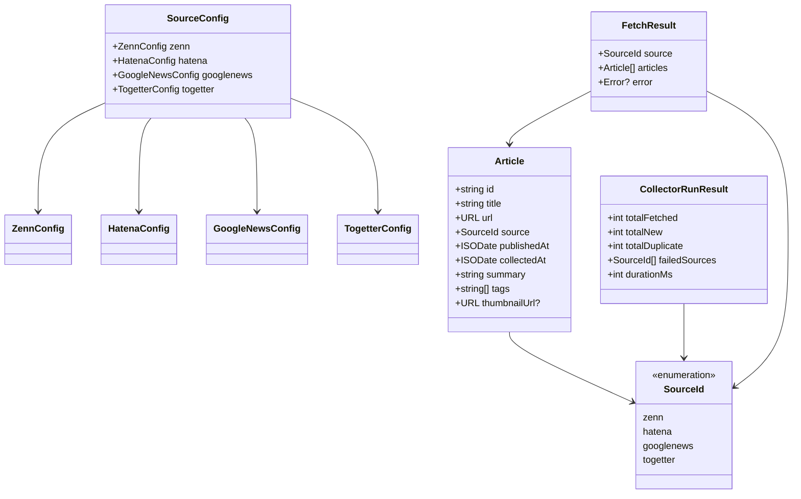

# Domain Entities — Unit 1 (Collector)

**Project**: news.hako.tokyo
**Stage**: CONSTRUCTION — Functional Design
**Created**: 2026-04-25

このドキュメントは Unit 1 (Collector) のドメインモデル — エンティティ、値オブジェクト、関係 — を定義します。**技術非依存**で記述し、TypeScript シグネチャは Application Design (component-methods.md) を引き継ぎつつ詳細化します。

---

## 1. Domain Model Overview



### Text Alternative
- `Article` 中心のドメイン。`SourceId` enum で 4 ソースを区別。
- `SourceConfig` は 4 つの設定型 (`ZennConfig` / `HatenaConfig` / `GoogleNewsConfig` / `TogetterConfig`) を集約。
- `CollectorRunner.run()` は `CollectorRunResult` を返す。各 Adapter は `FetchResult` を内部的に返す。

---

## 2. Core Entity: `Article`

### 2.1 TypeScript 定義 (Q2 = A: `zod` を採用)

```typescript
// next/lib/article.ts
import { z } from "zod";

export const ARTICLE_SOURCES = ["zenn", "hatena", "googlenews", "togetter"] as const;
export const SourceIdSchema = z.enum(ARTICLE_SOURCES);
export type SourceId = z.infer<typeof SourceIdSchema>;

// Article は TypeScript 内では camelCase を使う (一貫性のため)
export const ArticleSchema = z.object({
  id: z.string().min(1),
  title: z.string().min(1).max(500),
  url: z.string().url(),
  source: SourceIdSchema,
  publishedAt: z.string().datetime({ offset: true }),  // ISO 8601, 例: "2026-04-25T07:00:00+09:00"
  collectedAt: z.string().datetime({ offset: true }),
  summary: z.string(),                                  // 空文字許容
  tags: z.array(z.string()),                            // 空配列許容
  thumbnailUrl: z.string().url().nullable(),
});
export type Article = z.infer<typeof ArticleSchema>;
```

### 2.2 Markdown frontmatter 定義 (Q3 = B: **snake_case**)

frontmatter は **snake_case**、TypeScript Article 型は **camelCase**。両者の変換は専用 schema で行う。

```typescript
// next/lib/article.ts (続き)

// Markdown 上の frontmatter は snake_case
export const ArticleFrontmatterSchema = z.object({
  id: z.string().min(1),
  title: z.string().min(1).max(500),
  url: z.string().url(),
  source: SourceIdSchema,
  published_at: z.string().datetime({ offset: true }),
  collected_at: z.string().datetime({ offset: true }),
  summary: z.string(),
  tags: z.array(z.string()),
  thumbnail_url: z.string().url().nullable(),
});

// 双方向変換ヘルパ (PBT-02 Round-trip テストで検証)
export function toFrontmatter(article: Article): z.infer<typeof ArticleFrontmatterSchema> {
  return {
    id: article.id,
    title: article.title,
    url: article.url,
    source: article.source,
    published_at: article.publishedAt,
    collected_at: article.collectedAt,
    summary: article.summary,
    tags: article.tags,
    thumbnail_url: article.thumbnailUrl,
  };
}
export function fromFrontmatter(raw: unknown): Article {
  const fm = ArticleFrontmatterSchema.parse(raw);
  return ArticleSchema.parse({
    id: fm.id,
    title: fm.title,
    url: fm.url,
    source: fm.source,
    publishedAt: fm.published_at,
    collectedAt: fm.collected_at,
    summary: fm.summary,
    tags: fm.tags,
    thumbnailUrl: fm.thumbnail_url,
  });
}
```

### 2.3 各フィールドの意味と制約

| フィールド (camelCase / snake_case) | 型 | 必須 | 制約 / 意味 |
|---|---|---|---|
| `id` / `id` | string | ✅ | URL の SHA-256 ハッシュを Base36 で 16 文字に短縮した値。`hash:{base36-16chars}` の生成は `MarkdownWriter` 側で生成。決定的なため再収集時も同一 URL は同一 ID。 |
| `title` / `title` | string | ✅ | 1〜500 文字。前後空白トリム。改行は半角空白に置換。 |
| `url` / `url` | string (URL) | ✅ | 元記事の外部 URL。**正規化前** の値を保存 (重複排除には正規化値を使うが、保存は元のまま)。 |
| `source` / `source` | `SourceId` | ✅ | "zenn" / "hatena" / "googlenews" / "togetter" |
| `publishedAt` / `published_at` | string (ISO 8601) | ✅ | ソースから取得した公開日時。タイムゾーンオフセット付き。 |
| `collectedAt` / `collected_at` | string (ISO 8601) | ✅ | このプロジェクトが収集した日時。`CollectorRunner` が付与。 |
| `summary` / `summary` | string | ✅ | RSS の `<description>` / Atom の `<summary>` / NewsRSS の `<description>` / Togetter のタイトル下抜粋。HTML タグ除去 + 前後空白トリム。空文字許容。長文は最大 1000 文字に切り詰め。 |
| `tags` / `tags` | string[] | ✅ | 取得不能なら `[]`。要素は前後空白トリム + 空文字除外。 |
| `thumbnailUrl` / `thumbnail_url` | string (URL) \| null | ✅ | RSS `<media:thumbnail>` / Atom `<thumbnail>` / OGP 等から取得可能なら URL、不能なら `null`。 |

### 2.4 ID 生成ロジック (決定的)

```typescript
// 擬似コード
function generateArticleId(url: string): string {
  // 1. URL を「重複排除のための軽い正規化」(後述 §4) で正規化
  const normalized = normalizeUrlForDedup(url);
  // 2. SHA-256 ハッシュを取得
  const hash = sha256(normalized);  // Buffer
  // 3. Base36 で 16 文字に短縮
  return base36Truncate(hash, 16);  // 例: "k9xr2p1m3qaztb47"
}
```

**重要**: `id` は **正規化済み URL のハッシュ** とする。これにより `utm_*` 違いの同一記事が同じ `id` を持ち、(万が一 Deduplicator をすり抜けても) ファイル名衝突回避サフィックスで明示できる。

---

## 3. Source Configurations

### 3.1 `ZennConfig`
```typescript
export const ZennConfigSchema = z.object({
  enabled: z.boolean(),
  feedUrls: z.array(z.string().url()).min(1),
  maxItemsPerRun: z.number().int().positive().default(50),  // Q9 = A
});
```

**MVP 初期値** (Q10 = A):
```typescript
zenn: {
  enabled: true,
  feedUrls: ["https://zenn.dev/feed"],
  maxItemsPerRun: 50,
}
```

### 3.2 `HatenaConfig`
```typescript
export const HatenaConfigSchema = z.object({
  enabled: z.boolean(),
  feedUrls: z.array(z.string().url()).min(1),
  maxItemsPerRun: z.number().int().positive().default(50),
});
```

**MVP 初期値**:
```typescript
hatena: {
  enabled: true,
  feedUrls: ["https://b.hatena.ne.jp/hotentry/it.rss"],
  maxItemsPerRun: 50,
}
```

### 3.3 `GoogleNewsConfig`
```typescript
export const GoogleNewsTopicSchema = z.enum([
  "WORLD", "NATION", "BUSINESS", "TECHNOLOGY",
  "ENTERTAINMENT", "SPORTS", "SCIENCE", "HEALTH",
]);
export const GoogleNewsConfigSchema = z.object({
  enabled: z.boolean(),
  hl: z.string().default("ja"),
  gl: z.string().default("JP"),
  ceid: z.string().default("JP:ja"),
  queries: z.array(z.string().min(1)).default([]),
  topics: z.array(GoogleNewsTopicSchema).default([]),
  geos: z.array(z.string().min(1)).default([]),
  maxItemsPerRun: z.number().int().positive().default(50),
});
```

**MVP 初期値**:
```typescript
googlenews: {
  enabled: true,
  hl: "ja",
  gl: "JP",
  ceid: "JP:ja",
  queries: ["AI"],
  topics: ["TECHNOLOGY"],
  geos: [],
  maxItemsPerRun: 50,
}
```

### 3.4 `TogetterConfig`
```typescript
export const TogetterConfigSchema = z.object({
  enabled: z.boolean(),
  targetUrls: z.array(z.string().url()),
  requestIntervalMs: z.number().int().nonnegative().default(5000),  // Q7 配慮
  maxItemsPerRun: z.number().int().positive().default(30),  // Q9 配慮
});
```

**MVP 初期値** (Q7 = A: カテゴリ別人気まとめ):
```typescript
togetter: {
  enabled: true,
  targetUrls: ["https://togetter.com/category/news"],
  requestIntervalMs: 5000,
  maxItemsPerRun: 30,
}
```

> **注意 (RISK-01 / OQ-01)**: Togetter の利用規約・robots.txt の確認は **NFR Requirements (次ステージ)** で実施します。確認結果が NG だった場合は `enabled: false` に変更、または対象を限定します。本 Functional Design は規約適合を前提に設計しています。

### 3.5 `SourceConfig` (集約)
```typescript
export const SourceConfigSchema = z.object({
  zenn: ZennConfigSchema,
  hatena: HatenaConfigSchema,
  googlenews: GoogleNewsConfigSchema,
  togetter: TogetterConfigSchema,
});
export type SourceConfig = z.infer<typeof SourceConfigSchema>;
```

---

## 4. URL 正規化値オブジェクト (Q5 = B: 軽い正規化)

### 4.1 仕様

```typescript
// next/scripts/collector/lib/url-normalize.ts
const TRACKING_PARAMS = new Set([
  "utm_source", "utm_medium", "utm_campaign", "utm_term", "utm_content",
  "gclid", "fbclid", "mc_cid", "mc_eid", "yclid", "msclkid",
]);

export function normalizeUrlForDedup(rawUrl: string): string {
  const u = new URL(rawUrl);
  // 1. ホスト名を小文字化 (URL コンストラクタが自動で行う)
  // 2. 末尾スラッシュを除去 (root path "/" のみ例外)
  if (u.pathname.length > 1 && u.pathname.endsWith("/")) {
    u.pathname = u.pathname.slice(0, -1);
  }
  // 3. トラッキング系クエリパラメータを除去
  for (const key of [...u.searchParams.keys()]) {
    if (TRACKING_PARAMS.has(key.toLowerCase())) {
      u.searchParams.delete(key);
    }
  }
  // 4. クエリパラメータを名前でソート
  u.searchParams.sort();
  // 5. fragment は無視
  u.hash = "";
  return u.toString();
}
```

### 4.2 不変条件 (PBT-03 で検証)
- `normalizeUrlForDedup(normalizeUrlForDedup(x))` = `normalizeUrlForDedup(x)` (冪等性)
- 出力は妥当な URL である
- `utm_*` / `gclid` / `fbclid` 等は出力に現れない
- 末尾スラッシュは出現しない (root を除く)

---

## 5. Slug 値オブジェクト (Q4 = C: ハイブリッド)

### 5.1 仕様

```typescript
// next/scripts/collector/lib/slug-builder.ts
const SLUG_MAX_LENGTH = 50;
const SLUG_PATTERN = /^[a-z0-9-]+$/;

export class SlugBuilder {
  build(title: string, articleId: string): string {
    // 1. ASCII 抽出: 英字・数字・半角ハイフンのみ残す
    const ascii = title
      .toLowerCase()
      .replace(/[^a-z0-9-\s]/g, "")  // 非 ASCII / 記号を除去
      .replace(/\s+/g, "-")           // 空白をハイフンに
      .replace(/-+/g, "-")            // 連続ハイフンを 1 つに
      .replace(/^-|-$/g, "");         // 先頭末尾のハイフン除去

    // 2. ASCII slug が空 or 短すぎる (3 文字未満) なら、id の先頭 8 文字をフォールバック
    if (ascii.length < 3) {
      return articleId.slice(0, 8);
    }

    // 3. 長さ上限 (SLUG_MAX_LENGTH 文字) を超える場合は切り詰め
    let slug = ascii.length > SLUG_MAX_LENGTH ? ascii.slice(0, SLUG_MAX_LENGTH) : ascii;
    slug = slug.replace(/-$/, "");  // 切り詰めで末尾ハイフンが残った場合除去

    // 4. ASCII slug + id の先頭 6 文字を `--` で連結 (衝突回避兼可読性)
    //    例: "rss-feed-no-tsukaikata--k9xr2p"
    const idSuffix = articleId.slice(0, 6);
    const combined = `${slug}--${idSuffix}`;
    return combined.length > SLUG_MAX_LENGTH
      ? `${slug.slice(0, SLUG_MAX_LENGTH - 8)}--${idSuffix}`
      : combined;
  }
}
```

### 5.2 不変条件 (PBT-03 で検証)
- 出力は `^[a-z0-9-]+$` を満たす
- 出力長は 1 以上、`SLUG_MAX_LENGTH` 以下
- 同一の `(title, articleId)` ペアからは常に同じ slug が生成される (決定性)
- 出力に連続ハイフン `--` は **`--{id-suffix}` の 1 箇所のみ** 許容
- `articleId` が異なれば slug は異なる (衝突回避保証)

---

## 6. Markdown File Format

### 6.1 ファイル名規約 (Q3 = A の確定形)
```
content/{published_at(YYYY-MM-DD)}-{slug}.md
```

例: `content/2026-04-25-zenn-no-rss-feed--k9xr2p.md`

**衝突発生時** (極めて稀): 同一の `published_at` + `slug` のファイルが既に存在し、かつ `id` が異なる場合は、`-N.md` (N=2,3,...) を付与する。

### 6.2 ファイル本体構造 (Q3=B / Q8=B)

````markdown
---
id: k9xr2p1m3qaztb47
title: "Zenn の RSS フィードの使い方"
url: https://zenn.dev/foo/articles/bar
source: zenn
published_at: "2026-04-25T07:00:00+09:00"
collected_at: "2026-04-25T22:05:12+09:00"
summary: "Zenn の RSS フィード URL の構造とユースケース別の取得例を紹介"
tags: ["RSS", "Zenn"]
thumbnail_url: https://zenn.dev/images/og.png
---

# Zenn の RSS フィードの使い方

Zenn の RSS フィード URL の構造とユースケース別の取得例を紹介
````

### 6.3 frontmatter ↔ Article 変換のラウンドトリップ性 (PBT-02)
- `fromFrontmatter(toFrontmatter(article))` = `article`
- 例外: `summary` を本文に書き出す処理は **読み込み時に frontmatter 側を信頼**。本文は表示用 (Web Frontend 側) のみで、ラウンドトリップの対象は frontmatter のみとする。
