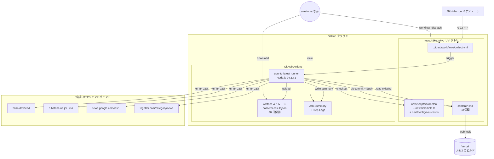

# Deployment Architecture — Unit 1 (Collector)

**Project**: news.hako.tokyo
**Stage**: CONSTRUCTION — Infrastructure Design (depth: minimal)
**Created**: 2026-04-25

このドキュメントは Unit 1 (Collector) の **デプロイメントアーキテクチャ** — どのインフラ要素がどこにあり、どう連携するか — を可視化します。

---

## 1. Deployment Topology



### Text Alternative
- `Cron スケジューラ` または `umatoma さん の手動実行` が `.github/workflows/collect.yml` をトリガ
- `GitHub Actions runner` (ubuntu-latest, Node.js 24.13.1) が起動し、リポジトリを checkout
- runner が `next/scripts/collector/` を実行、外部 4 ソース (Zenn / Hatena / Google ニュース / Togetter) に HTTP GET
- 取得結果を `content/*.md` として書出し、git commit + push
- `collector-result.json` を artifact として upload
- Job Summary に整形済み Markdown を書き出し
- `main` への push が Vercel に webhook 通知 → Unit 2 のビルドが起動 (Unit 2 で詳細)

---

## 2. ランタイム要素

| 要素 | 場所 | ライフサイクル |
|---|---|---|
| `collect.yml` (Workflow 定義) | リポジトリ `.github/workflows/` | 永続 (コードの一部) |
| GitHub Actions runner | GitHub クラウド (ephemeral VM) | 1 ジョブごと数分間。実行終了後に破棄 |
| Collector プロセス | runner 内の Node.js プロセス | ジョブ実行中のみ |
| HTTP コネクション | runner ↔ 外部 4 サービス | 各リクエストごとに張る/閉じる |
| Markdown ファイル | リポジトリ `content/` (Git 管理) | 永続 |
| `collector-result.json` | runner のワークスペース → Artifact ストレージ | 30 日保持 (Q7=C, U1-NFR-OBS-04) |
| Job Summary | GitHub UI 上のジョブ詳細ページ | GitHub のログ保持期間 (90 日) |
| Step Logs (stdout) | GitHub UI 上のステップログ | 同上 |

### Stateless 性
- GitHub Actions runner は **ephemeral** (実行ごとに作り直し)
- Collector の **状態は git リポジトリの `content/`** が唯一のソース・オブ・トゥルース
- `Deduplicator` は実行のたびに `content/*.md` を読み直す → State なし

---

## 3. データフロー

### 3.1 入力データの流れ

```
外部ソース (HTTPS, Public)
    ↓ HTTP GET (タイムアウト 30 秒)
GitHub Actions runner (Node.js プロセス)
    ↓ rss-parser / cheerio / gray-matter / zod
Article[] (in-memory)
    ↓ Deduplicator.filterNew (URL 軽い正規化)
新規 Article[] (in-memory)
    ↓ MarkdownWriter (frontmatter snake_case + 本文 H1 + summary)
content/*.md (Git ステージング)
    ↓ git commit + push
GitHub リポジトリ main ブランチ
```

### 3.2 出力 (副作用) の流れ

```
CollectorRunner.run()
    ├─ stdout (Logger) → GitHub Actions ステップログ
    ├─ collector-result.json (JobSummaryReporter) →
    │       ├─ Job Summary に整形して書出し → GitHub UI
    │       └─ actions/upload-artifact → Artifact ストレージ (30 日)
    ├─ content/{date}-{slug}.md (MarkdownWriter) → Git → main → Vercel webhook
    └─ exit code (0 通常 / 1 致命エラー) → GitHub Actions の成功/失敗判定
```

---

## 4. Trigger / 実行モデル

### 4.1 schedule (cron)
- パターン: `0 22 * * *` (毎日 22:00 UTC = 翌 07:00 JST)
- GitHub Actions の cron は **実時刻から数分〜十数分の遅延** がありうる
- 個人利用かつ SLA なしのため許容範囲

### 4.2 workflow_dispatch (手動)
- GitHub UI または `gh workflow run collect.yml` で起動
- 手動実行は cron と並走しない (concurrency 制御で順序付け)

### 4.3 concurrency 制御 (Q1=B)
- `group: collect`、`cancel-in-progress: false`
- 先行実行が走っている間に新しいトリガが来た場合、**先行を最後まで完走** → 新トリガはキューに入る
- これにより `git push` の競合を避け、データ欠損を防ぐ

---

## 5. 失敗時の振る舞い

| 失敗ケース | 振る舞い | 通知 |
|---|---|---|
| Adapter 単体の HTTP 失敗 | 該当 Adapter の `failedSources` に記録、CollectorRunner は継続 (BR-51) | ジョブ自体は **成功** (exit 0)、ログ + collector-result.json で確認可能 |
| 4 Adapter 全て失敗 | `totalNew = 0`、コミットせず終了 | 同上 (exit 0)、artifact / Job Summary で原因確認 |
| `Deduplicator.initialize()` が既存 frontmatter 不整合で失敗 | exit code 1、致命エラー | GitHub Actions 失敗通知 (デフォルト) |
| `MarkdownWriter` の I/O 失敗 | 同上 | 同上 |
| `git commit` / `git push` が失敗 (権限 / ネットワーク等) | ジョブが `exit 1` | 同上 |
| `timeout-minutes: 10` 超過 | GitHub Actions が job を強制終了 (`exit 124` 相当) | 同上 |

---

## 6. ローカル実行との関係

`collect.yml` は GitHub Actions 専用ですが、**ローカル PC でも開発時に Collector を直接実行可能**:

```bash
cd next
npm install
npm run collect
# 結果は next/collector-result.json および content/*.md
# git commit/push は手動 (CI と同等の自動コミット動作はしない)
```

これは **Job Summary なし** (`GITHUB_STEP_SUMMARY` 未設定) で実行されるが、stdout プレーンログ + `collector-result.json` の出力は同じ。

---

## 7. Vercel 連携 (Unit 2 への引き渡しポイント)

- `main` ブランチへの **push が Vercel webhook** をトリガ
- Vercel が `next/` を Root Directory として `next build` を実行 (Unit 2 で詳細)
- `content/*.md` を `next/lib/articles.ts` (Web 側 ArticleRepository) が build 時に読み込み、SSG で HTML 生成
- 注意: `content/` は `next/` の **親ディレクトリ** にあるため、Vercel の "Include source files outside of the Root Directory" 等の設定が必要 (Unit 2 Infrastructure Design で対応)

---

## 8. デプロイ準備チェックリスト (Construction 完了時の確認)

- [ ] `next/package.json` に `"scripts": { "collect": "tsx scripts/collector/index.ts", ... }` を追加
- [ ] `next/scripts/collector/` 全実装が完了
- [ ] `next/config/sources.ts` の MVP 初期値が設定済み (Q10=A, U1-NFR-COMP)
- [ ] `next/lib/article.ts` に Article 型 + zod schema (camelCase / snake_case) を定義
- [ ] `.github/workflows/collect.yml` 作成
- [ ] リポジトリ Settings > Actions > General > Workflow permissions が "Read and write permissions" になっていることを確認 (workflow 内 `permissions:` で指定するため必須ではないが念のため)
- [ ] `.gitignore` に `next/collector-result.json` を追加 (Code Generation で実施)
- [ ] `content/` ディレクトリを git に登録 (空でもよい、`.gitkeep` を置く)
- [ ] 初回 `workflow_dispatch` で手動実行し、ログ / artifact / Job Summary が想定どおり出力されることを確認 (Build and Test 段階で実施)

---

## 9. PBT 適用状況 (本ステージ)

- 本ステージ (Infrastructure Design) は **PBT 直接適用なし** (Code Generation / Build and Test で評価)
- PBT-09 (Framework Selection): ✅ 確定済 (Vitest + fast-check)
- 本ステージはインフラマッピングのみで、ロジックを含まないため PBT の対象外

---

## 10. 拡張機能コンプライアンス サマリー

| Extension | 評価 | コメント |
|---|---|---|
| Security Baseline | 全 N/A (拡張機能 無効) | U1-NFR-SEC-01〜07 が代替最小ガード。`permissions: contents: write` の最小化を確認 (§2.4) |
| PBT (Partial) | N/A (本ステージ対象外) | Code Generation 段階で評価 |
