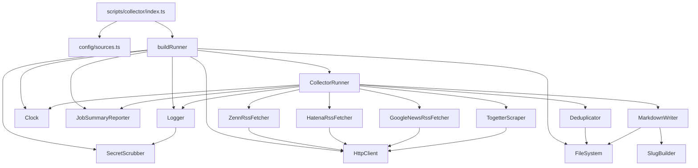

# Logical Components — Unit 1 (Collector)

**Project**: news.hako.tokyo
**Stage**: CONSTRUCTION — NFR Design
**Created**: 2026-04-25

このドキュメントは Unit 1 (Collector) の **論理コンポーネント** (DI 抽象、横断的サービス、テスト用ヘルパ等) を整理し、Code Generation の実装単位を明確にします。Application Design / Functional Design で確定した主要コンポーネントは別ドキュメントを参照してください。本ドキュメントは **NFR を実現するために追加で必要な論理コンポーネント** に焦点を当てます。

---

## 1. NFR Design で追加される論理コンポーネント

| コンポーネント | カテゴリ | 役割 | NFR との対応 |
|---|---|---|---|
| `Logger` | 観測性 | stdout プレーンログ + 構造化レポート蓄積の薄い wrapper | U1-NFR-OBS-01〜03、Q9=A |
| `Clock` | テスト容易性 | `() => Date` 関数型抽象 | Q2=A、U1-NFR-MAINT-03 |
| `HttpClient` | 抽象化 + テスト容易性 | HTTP GET の薄い wrapper (タイムアウト、User-Agent 注入) | U1-NFR-PERF-02、U1-NFR-SEC-07 |
| `FileSystem` | 抽象化 + テスト容易性 | ディレクトリスキャン、ファイル read/write 抽象 | U1-NFR-MAINT-03 |
| `JobSummaryReporter` | CI 連携 | `$GITHUB_STEP_SUMMARY` + `collector-result.json` を出力 | U1-NFR-OBS-02、Q7=C |
| `SecretScrubber` | セキュリティ | ログ出力前の secret パターン除去 (将来用) | U1-NFR-SEC-04、BR-60 |

---

## 2. `Logger` (自作の薄い wrapper)

### 2.1 インターフェイス
```typescript
// next/scripts/collector/logger.ts
type LogLevel = "info" | "warn" | "error";

interface LogContext {
  source?: SourceId | "collector";
  [key: string]: unknown;
}

interface Logger {
  info(message: string, context?: LogContext): void;
  warn(message: string, context?: LogContext): void;
  error(message: string, context?: LogContext): void;
  // 構造化レポート用エントリの追加
  addReport(entry: ReportEntry): void;
  flushReport(): CollectorRunResult;
}
```

### 2.2 出力フォーマット (stdout)
```text
[INFO][collector] start
[INFO][zenn] fetched count=23
[WARN][hatena] thumbnail not found
[ERROR][googlenews] fetch failed error=...
[INFO][collector] done totalFetched=88 totalNew=42 ...
```

### 2.3 内部状態
- **stdout 出力**: 都度 `console.log` (or `process.stdout.write`)
- **`reports` 配列**: 各 source/event のレポートエントリを蓄積
- `flushReport()` で `reports` を集約し `CollectorRunResult` を生成

### 2.4 関連パターン
- 単一インスタンスを `CollectorRunner` がコンストラクタで受け取る (DI)
- `SecretScrubber` を経由してから出力 (5 章)

---

## 3. `Clock` (時刻注入)

### 3.1 インターフェイス
```typescript
// next/scripts/collector/lib/clock.ts
export type Clock = () => Date;

export const systemClock: Clock = () => new Date();

// テスト用ファクトリ
export const fixedClock = (iso: string): Clock => {
  const date = new Date(iso);
  return () => date;
};
```

### 3.2 利用箇所
- `CollectorRunner.run()`: `collectedAt = clock().toISOString()` の付与
- (将来) Adapter 内で `publishedAt` 取得不能時のフォールバック (`now()` 代替)
- `CollectorRunResult.durationMs` の計測 (`start = clock(); ...; durationMs = clock() - start`)

---

## 4. `HttpClient` (抽象化)

### 4.1 インターフェイス
```typescript
// next/scripts/collector/lib/http-client.ts
export interface HttpResponse {
  status: number;
  body: string;
  headers: Record<string, string>;
}

export interface HttpClient {
  get(url: string, options?: HttpClientGetOptions): Promise<HttpResponse>;
}

export interface HttpClientGetOptions {
  headers?: Record<string, string>;
  timeoutMs?: number;  // デフォルト 30000
}
```

### 4.2 デフォルト実装
- `node:fetch` (Node.js 18+ globals) を内部で使用
- `AbortSignal.timeout(timeoutMs)` でタイムアウト制御
- `User-Agent` ヘッダのデフォルト値 `news.hako.tokyo collector (umatoma)` をマージ

### 4.3 テスト用差し替え
- `RecordingHttpClient` (テスト用): `Map<urlPattern, HttpResponse>` で固定レスポンスを返す

### 4.4 関連 NFR
- U1-NFR-PERF-02 (タイムアウト 30 秒)
- U1-NFR-SEC-07 (User-Agent 明示)

---

## 5. `FileSystem` (抽象化)

### 5.1 インターフェイス
```typescript
// next/scripts/collector/lib/file-system.ts
export interface FileReader {
  listMarkdownFiles(dir: string): Promise<string[]>;  // .md のみ、再帰
  readText(filePath: string): Promise<string>;
  exists(filePath: string): Promise<boolean>;
}

export interface FileSystem extends FileReader {
  ensureDir(dir: string): Promise<void>;
  writeText(filePath: string, content: string): Promise<void>;
}
```

### 5.2 デフォルト実装
- `node:fs/promises` を使用
- `listMarkdownFiles` は再帰スキャン (`readdir` + `stat`)

### 5.3 テスト用差し替え
- `InMemoryFileSystem` (テスト用): `Map<filePath, content>` で完結
- PBT-02 (frontmatter ↔ Article ラウンドトリップ) のテストで使用

---

## 6. `JobSummaryReporter` (CI 連携)

### 6.1 役割
- `CollectorRunResult` を Markdown 整形
- 環境変数 `GITHUB_STEP_SUMMARY` (= ファイルパス) が設定されていれば、そこに append
- 同時に `collector-result.json` を所定パスに書き出し

### 6.2 インターフェイス
```typescript
// next/scripts/collector/lib/job-summary-reporter.ts
export interface JobSummaryReporter {
  emit(result: CollectorRunResult, perSourceCount: Record<SourceId, number>): Promise<void>;
}
```

### 6.3 出力 (Job Summary Markdown 例)
```markdown
## Collector run summary

- Run at: `2026-04-25T22:05:12+09:00`
- Duration: `12.3s`
- Total fetched: **88**
- Total new: **42** (committed)
- Total duplicate: **46**

| Source | Fetched | Status |
|---|---:|---|
| zenn | 23 | ✅ |
| hatena | 50 | ✅ |
| googlenews | 0 | ❌ fetch failed: ... |
| togetter | 15 | ✅ |
```

### 6.4 関連 NFR
- U1-NFR-OBS-02 (Job Summary + artifact)
- Q7=C (NFR Requirements)

---

## 7. `SecretScrubber` (将来拡張用、ログ前処理)

### 7.1 役割
- `Logger` の出力前にメッセージから既知の secret パターンを `[REDACTED]` に置換
- MVP では API キー使用なしのため実害は無いが、将来のために組込む

### 7.2 既知パターン (初期セット)
```typescript
const SECRET_PATTERNS: RegExp[] = [
  /Bearer\s+[A-Za-z0-9._-]+/g,
  /Authorization:\s*[A-Za-z0-9._-]+/gi,
  /(?:api[_-]?key|token|secret)\s*[:=]\s*["']?[A-Za-z0-9._-]+/gi,
  // 必要に応じて追加
];
```

### 7.3 関連 NFR
- BR-60、U1-NFR-SEC-04

---

## 8. コンポーネント全体の組み立て (DI ツリー)



### Text Alternative
- `index.ts` (エントリ) が `config/sources.ts` を静的 import (Q3=A) し、`buildRunner({ config, logger, clock, http, fs, jsr, scrubber })` を呼び出す
- `buildRunner` は依存全体を組み立てて `CollectorRunner` を返す
- `CollectorRunner` は `Logger` / `Clock` / `Deduplicator` / `MarkdownWriter` / `JobSummaryReporter` / 4 Fetcher を保持
- 各 `Fetcher` は `HttpClient` を持つ
- `Deduplicator` / `MarkdownWriter` は `FileSystem` を持つ
- `MarkdownWriter` は `SlugBuilder` を持つ

---

## 9. 配置 (Code Generation 時の参照)

```text
next/scripts/collector/
├── index.ts                      # エントリ (DI ツリー組立 + run)
├── runner.ts                     # CollectorRunner クラス
├── builder.ts                    # buildRunner ファクトリ
├── logger.ts                     # Logger 実装
├── sources/
│   ├── source-fetcher.ts         # SourceFetcher interface
│   ├── zenn-rss-fetcher.ts
│   ├── hatena-rss-fetcher.ts
│   ├── google-news-rss-fetcher.ts
│   └── togetter-scraper.ts
└── lib/
    ├── article-id.ts             # generateArticleId
    ├── url-normalize.ts          # normalizeUrlForDedup
    ├── slug-builder.ts           # SlugBuilder
    ├── deduplicator.ts           # Deduplicator
    ├── markdown-writer.ts        # MarkdownWriter
    ├── http-client.ts            # HttpClient + デフォルト実装
    ├── file-system.ts            # FileSystem + デフォルト実装
    ├── clock.ts                  # Clock 抽象 + systemClock + fixedClock
    ├── job-summary-reporter.ts   # JobSummaryReporter
    └── secret-scrubber.ts        # SecretScrubber
```

> 詳細は Code Generation Plan で確定 (本配置は提案)。

---

## 10. PBT 適用 (Partial) のコンポーネント別整理

| コンポーネント | PBT Rule | テスト戦略 |
|---|---|---|
| `lib/article-id.ts` (`generateArticleId`) | PBT-03 | 決定性 (同じ URL → 同じ id)、Base36 文字種、長さ 16 |
| `lib/url-normalize.ts` (`normalizeUrlForDedup`) | PBT-03 | 冪等性、サニタイズ性、安定性 |
| `lib/slug-builder.ts` (`SlugBuilder.build`) | PBT-03 | 文字種 `[a-z0-9-]+`、長さ 1〜50、決定性、衝突回避 |
| `lib/deduplicator.ts` (`Deduplicator.filterNew`) | PBT-03 | 境界性 / 一意性 / 除外性 / 包含性 |
| `lib/markdown-writer.ts` + `lib/article.ts` | PBT-02 | toFrontmatter ↔ fromFrontmatter ラウンドトリップ |
| `test/generators/article.gen.ts` | PBT-07 | Article arbitrary を共通化 |
| `test/generators/rss-item.gen.ts` | PBT-07 | RssItem arbitrary を共通化 |
| 全 PBT | PBT-08 | seed をログ出力、Vitest 標準で再現性確保 |

> 例外: `Logger` / `Clock` / `HttpClient` / `FileSystem` / `JobSummaryReporter` / `SecretScrubber` は **副作用ベースの抽象** のため、PBT は適用しない (advisory)。代わりに example-based テスト + DI で動作確認。

---

## 11. NFR ID と論理コンポーネントの対応マトリクス

| NFR ID | 関連論理コンポーネント |
|---|---|
| U1-NFR-PERF-01 (5 分予算) | (横断、特定コンポーネントなし) |
| U1-NFR-PERF-02 (HTTP タイムアウト 30s) | `HttpClient` |
| U1-NFR-PERF-04 (取得件数上限) | `CollectorRunner` (slice ロジック) |
| U1-NFR-PERF-05 (Togetter rate) | `TogetterScraper` (sleep) |
| U1-NFR-REL-01 (失敗継続) | `CollectorRunner` (try/catch) |
| U1-NFR-REL-02 (リトライなし) | `HttpClient` (リトライロジック未実装) |
| U1-NFR-REL-03 (致命エラー) | `CollectorRunner` (throw 伝播) |
| U1-NFR-SEC-04 (ログサニタイズ) | `SecretScrubber` |
| U1-NFR-SEC-07 (User-Agent) | `HttpClient` |
| U1-NFR-OBS-01 (stdout + json) | `Logger` |
| U1-NFR-OBS-02 (Job Summary + artifact) | `JobSummaryReporter` |
| U1-NFR-OBS-03 (自作 Logger) | `Logger` |
| U1-NFR-MAINT-03 (DI / テスタビリティ) | `Clock` / `HttpClient` / `FileSystem` |
| U1-NFR-MAINT-04 (テスト命名) | (Code Generation で配置) |
| U1-NFR-CI-03〜06 (commit 戦略) | GitHub Actions ワークフロー (Infrastructure Design で確定) |
