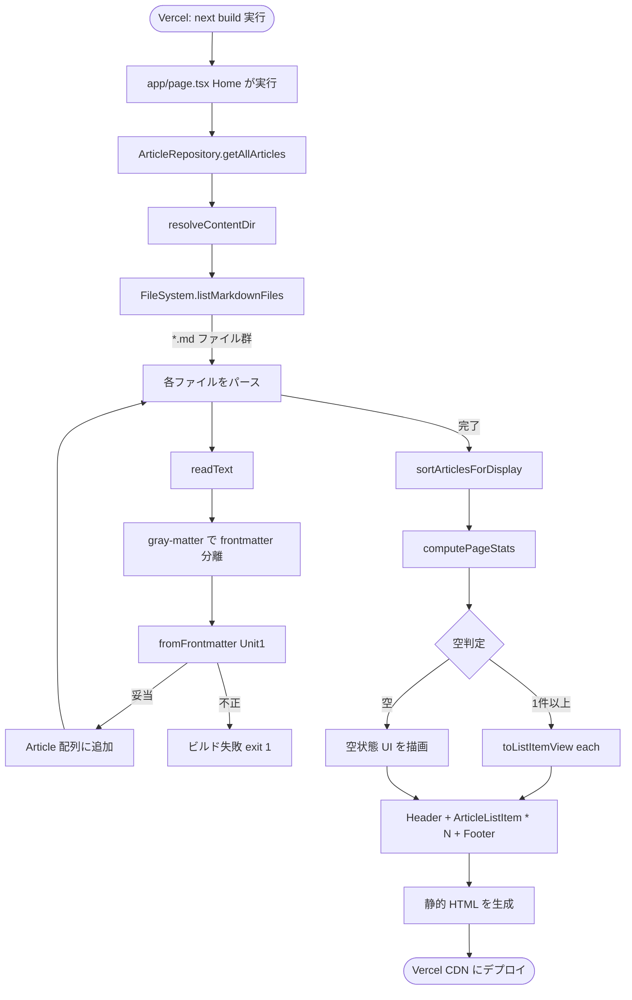

# Business Logic Model — Unit 2 (Web Frontend)

**Project**: news.hako.tokyo
**Stage**: CONSTRUCTION — Functional Design
**Created**: 2026-04-26

Unit 2 (Web Frontend) の SSG ビルド時の処理フロー、データ変換、エラー処理を定義します。

---

## 1. SSG レンダリングフロー



### Text Alternative

1. Vercel が `next build` を起動
2. `app/page.tsx` の `Home` (Server Component) が実行される
3. `ArticleRepository.getAllArticles()` を呼ぶ
4. `resolveContentDir()` で `content/` パスを解決 (環境変数優先、Q1=B)
5. `FileSystem.listMarkdownFiles()` で `*.md` を再帰スキャン
6. 各 ファイルを `readText` → `gray-matter` でパース → `fromFrontmatter` で `Article` 化
7. 不正 frontmatter は throw (ビルド失敗、データ不整合の早期可視化)
8. `sortArticlesForDisplay` でソート (publishedAt 降順 + collectedAt 降順、Q6=A)
9. `computePageStats` で「件数 / 最終更新」を計算
10. 空ならメッセージ (Q4=A)、1 件以上なら `toListItemView` で View 生成 → 描画
11. `Header → 一覧 (or 空状態) → Footer` (Q5=B) の HTML を生成

---

## 2. ArticleRepository.getAllArticles の擬似コード

```pseudocode
async function getAllArticles(): Promise<Article[]> {
    contentDir = resolveContentDir()
    files = await fileSystem.listMarkdownFiles(contentDir)
    articles = []
    for file in files:
        text = await fileSystem.readText(file)
        { data, content: _ } = matter(text)
        try:
            article = fromFrontmatter(data)  // Unit 1 で定義済
            articles.push(article)
        catch err:
            throw new Error(`Invalid frontmatter in ${file}: ${err.message}`)
    return articles
}
```

**注意**:
- ソートは行わない (Q6 の方針: Repository は Q6=A 対応の関数を別途 export し、`Home` で適用)
- 個別ファイルのスキーマ違反は throw → Vercel ビルド失敗 → 前回成功ビルドが保たれる (要件と整合)

---

## 3. Home コンポーネントの擬似コード

```pseudocode
async function Home(): Promise<JSX.Element> {
    rawArticles = await getAllArticles()
    sorted = sortArticlesForDisplay(rawArticles)
    stats = computePageStats(sorted)
    views = sorted.map(toListItemView)

    return (
        <>
            <Header stats={stats} />
            {views.length === 0
                ? <EmptyState />
                : <ArticleList views={views} />}
            <Footer stats={stats} />
        </>
    )
}
```

---

## 4. 副コンポーネントの責務

### 4.1 `Header`
- 入力: `stats: PageStats`
- 出力: サイトタイトル "news.hako.tokyo" + 件数 (`stats.totalArticles` 件)

### 4.2 `Footer`
- 入力: `stats: PageStats`
- 出力: 最終更新日 (`stats.lastUpdatedDisplay`、null なら "未収集") + サイト名 + (任意で) "Built with Next.js" 等

### 4.3 `EmptyState` (Q4=A)
- 静的: `<p>まだ記事がありません</p>` のみ
- スタイル: 中央寄せ、控えめのテキスト色

### 4.4 `ArticleList`
- 入力: `views: ArticleListItemView[]`
- 出力: `<ul>` で `<ArticleListItem>` を map して描画
- key には `view.id` を使う

### 4.5 `ArticleListItem`
- 入力: `view: ArticleListItemView`
- 出力 (構造):
  ```html
  <li>
    <article>
      <a href={view.url} target="_blank" rel="noopener noreferrer">
        <h2>{view.title}</h2>
      </a>
      <div>
        <span class="badge badge-{view.sourceId}">{view.sourceLabel}</span>
        <time dateTime={view.publishedAtIso}>{view.publishedAtDisplay}</time>
      </div>
    </article>
  </li>
  ```

---

## 5. CSS / Tailwind の方針

- **既存** `app/globals.css` の Tailwind ベースに追加 (置き換えではなく拡張)
- **ダークモード**: Tailwind v4 の `prefers-color-scheme` ベース (システム設定追従、Q14=B)
- **レスポンシブ**: `sm:` / `md:` ブレークポイントで一覧を 1 列 → 2 列等にしてもよい (MVP では 1 列で十分)
- **バッジ**:
  - 背景色をソース毎に変える (`badge-zenn` / `badge-hatena` / `badge-googlenews` / `badge-togetter`)
  - テキスト色は背景に応じて高コントラスト (light/dark 両対応)

---

## 6. レイアウト / メタデータ更新

### `RootLayout`
変更点 (既存からの差分):
- `<html lang="ja">` (現状 `lang="en"`)
- `metadata.title`: "news.hako.tokyo" (現状 "Create Next App")
- `metadata.description`: 短い説明 (例: "個人用ニュース集約サイト")
- 既存の Geist フォント / Tailwind 設定は維持
- `<body>` のクラスは既存の `min-h-full flex flex-col` を維持

---

## 7. エラー処理 / 境界値

| 状況 | 振る舞い |
|---|---|
| `content/` ディレクトリ自体が存在しない | `listMarkdownFiles` が空配列を返す → `EmptyState` 表示 (ビルドは成功) |
| `content/*.md` が 0 件 | `EmptyState` 表示 |
| `content/*.md` の中に 1 件でも frontmatter 不正がある | `getAllArticles` が throw → Vercel ビルド失敗 (前回ビルドが残る) |
| `content/*.md` の中に thumbnail_url が `null` | UI 上はサムネイル領域を表示しない (MVP ではサムネイル表示自体を最小限) |
| `Intl.DateTimeFormat` が想定外の挙動 | example-based テストでカバー、想定外時は ISO 文字列 (`publishedAtIso`) にフォールバック |
| ビルド時間がタイムアウト | Vercel デフォルトの 45 分制限内に収まる想定 (記事数 100 程度ならミリ秒) |

---

## 8. PBT (本ユニットで適用) のまとめ

| 関数 | PBT Rule | 検証内容 |
|---|---|---|
| `sortArticlesForDisplay` | PBT-03 | 出力長 = 入力長 / publishedAt 降順不変条件 / 同 publishedAt 内 collectedAt 降順 / 集合一致 |
| `computePageStats` | example-based | 入力件数 → totalArticles、空 → null フィールド、最大 collectedAt が反映 |
| `toListItemView` | example-based | sourceLabel が SOURCE_LABEL の値に従う / publishedAtIso が原値そのまま |
| `formatPublishedAt` | example-based | ja-JP ロケール出力の代表ケース |
| `ArticleRepository.getAllArticles` | example-based + InMemory FS | 既知 fixture からの全件取得 / 不正 frontmatter で throw |

---

## 9. Testable Properties (PBT-01 advisory)

### `sortArticlesForDisplay`
- **Length**: `output.length === input.length`
- **Permutation**: 出力の id 集合 = 入力の id 集合
- **Primary order**: 任意の隣接ペア `(a, b)` について `a.publishedAt >= b.publishedAt`
- **Secondary order**: `a.publishedAt === b.publishedAt` のとき `a.collectedAt >= b.collectedAt`

### `toListItemView`
- **Identity preservation**: `view.id === article.id`、`view.url === article.url`、`view.title === article.title`
- **Source mapping**: `view.sourceId === article.source` で、`view.sourceLabel === SOURCE_LABEL[article.source]`
- **Time preservation**: `view.publishedAtIso === article.publishedAt`

### `formatPublishedAt`
- **Format stability**: 同じ ISO 入力 → 常に同じ出力 (ロケール固定)
- **Non-empty**: 妥当な ISO 入力に対して空文字を返さない

---

## 10. Open Questions の引き継ぎ

| OQ | 状態 |
|---|---|
| OQ-03 (Vercel preview URL の E2E 取り回し) | Infrastructure Design で確定 |
| OQ-05 (Next.js 16 breaking changes) | **解消済** (本プランで確認、動的ルート無しのため影響なし) |

---

## 11. 関連ルール (Business Rules) への前置き

詳細は `business-rules.md` を参照。本ドキュメントの設計判断を支える業務ルールを次ステップでまとめます。
