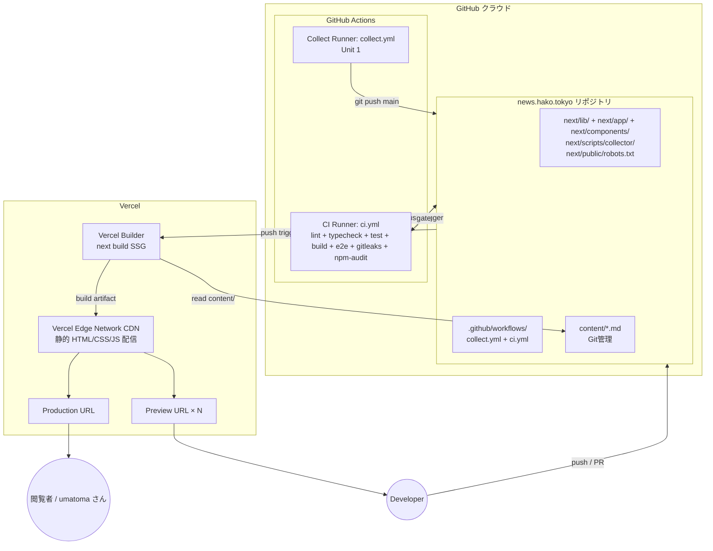

# Deployment Architecture — Unit 2 (Web Frontend)

**Project**: news.hako.tokyo
**Stage**: CONSTRUCTION — Infrastructure Design (depth: minimal)
**Created**: 2026-04-26

Unit 2 (Web Frontend) のデプロイメントアーキテクチャ — Vercel ホスティング + GitHub Actions CI の構成を可視化します。

---

## 1. Deployment Topology



### Text Alternative
- リポジトリには `next/` 配下のコード、`content/*.md`、`.github/workflows/{collect,ci}.yml` がある
- 開発者の push / PR と Unit 1 collect ジョブの commit が、両方とも:
  - GitHub Actions の `ci.yml` をトリガ (Lint / Typecheck / Test / Build / E2E / gitleaks / npm-audit)
  - Vercel の Builder にも webhook で通知される (`main` → Production、PR → Preview)
- Vercel Builder が `next/` を root として `next build` 実行、`<repo-root>/content/*.md` を読み込み静的 HTML を生成
- 出来上がった成果物を Vercel Edge Network CDN にデプロイし、Production URL / Preview URL で配信

---

## 2. ランタイム要素

| 要素 | 場所 | ライフサイクル |
|---|---|---|
| `next/app/page.tsx` (Home) | Vercel ビルド時のみ実行 (SSG) | ビルドごと |
| 静的 HTML / CSS / JS | Vercel Edge Network | デプロイの度に更新 |
| `content/*.md` | Git リポジトリ | 永続 |
| Vercel Builder | Vercel の管理ランナー | ビルドごと数十秒 |
| Vercel Edge Cache | グローバル CDN | デプロイで invalidate |
| Browser → CDN | HTTPS | リクエストごと |

### Stateless 性
- ランタイムの動的処理ゼロ (SSG)
- セッション / クッキー / DB なし
- 静的 HTML を CDN から配信するだけ

---

## 3. データフロー

### 3.1 ビルド時
```
content/*.md (Git)
    ↓ Vercel が repo を clone
    ↓ next build (Root Directory: next/)
    ↓ Home → ArticleRepository → readText (../content/*.md)
    ↓ getAllArticles → sortArticlesForDisplay → toListItemView
    ↓ JSX を静的 HTML としてレンダリング
    ↓ Vercel Build Output (.vercel/ 等)
    ↓
Vercel Edge Network にデプロイ
```

### 3.2 リクエスト時
```
ブラウザ
    ↓ HTTPS GET /
Vercel Edge (CDN)
    ↓ static HTML / CSS / JS
ブラウザに表示
```

リクエスト時にはサーバ側のロジックは走らない。

---

## 4. Trigger / 実行モデル

### 4.1 Production
- トリガ: `main` ブランチへの push
- 含まれる push:
  - 開発者の手動 push (PR merge 等)
  - Unit 1 collect ジョブの自動 commit
- Vercel が即座に Production デプロイを実行
- 完了後、Production URL が新しいビルドに切り替わる

### 4.2 Preview
- トリガ: PR の作成 / 更新
- 各 PR 用に独立した URL が発行される (例: `https://news-hako-tokyo-{hash}.vercel.app`)
- マージされると Preview は引き続き残るが、後で auto-cleanup される (Vercel デフォルト)

### 4.3 Manual Promotion / Rollback
- Vercel Dashboard で過去の deployment を "Promote to Production" することで即座にロールバック可能

---

## 5. CI / Build パイプラインの順序

```
Git push (main or PR)
    ├─ GitHub Actions ci.yml が起動 (並行)
    │   ├─ static-checks (lint + typecheck + test) — gate
    │   ├─ build — gate (needs static-checks)
    │   ├─ e2e (Playwright local) — gate (needs build)
    │   ├─ gitleaks — gate (並列)
    │   └─ npm-audit — warn only (並列)
    └─ Vercel が builder 起動 (並行)
        └─ next build → CDN にデプロイ
```

GitHub Actions と Vercel は **独立** に動作。CI が失敗しても Vercel デプロイは進む (デフォルト)。これは個人利用の MVP では許容、将来は GitHub Branch Protection や Vercel "Skip Deployments" 連携で gate 化可能。

---

## 6. 失敗時の振る舞い

| 失敗ケース | 振る舞い |
|---|---|
| Vercel ビルド失敗 (frontmatter 不正等) | 前回成功 deployment が維持される。Production URL は引き続き古いコンテンツを返す。Vercel Dashboard でエラーログを確認可能 |
| GitHub Actions CI 失敗 | PR は failing チェックでマージ不可 (Branch Protection を別途設定推奨)。main 直 push の場合は警告のみ |
| Playwright E2E 失敗 | CI が gate でブロック。Trace は GitHub Actions artifact にアップ |
| Vercel Edge ダウン (極めて稀) | Vercel SLA に依存、ユーザー側でできる対処はなし |
| `content/*.md` の git push 競合 | Unit 1 collect ジョブで `concurrency: cancel-in-progress: false` のためキューイングされ、競合は次回実行で解消 |

---

## 7. Domain / DNS (任意、ユーザー設定)

- Vercel Dashboard で `news.hako.tokyo` 等のカスタムドメインを設定 (任意)
- DNS プロバイダで Vercel に向ける CNAME / A レコードを追加
- Vercel が自動で TLS 証明書を発行 (Let's Encrypt 経由)
- MVP では Vercel デフォルトの `*.vercel.app` URL でも十分

---

## 8. ローカル開発との関係

### 8.1 開発サーバ
```bash
cd next
npm run dev   # http://localhost:3000 (Turbopack デフォルト、Next.js 16)
```
ローカル `next dev` は `<repo-root>/content/*.md` を直接読み込む。

### 8.2 ローカルビルド確認
```bash
cd next
npm run build
npm run start   # http://localhost:3000
```
本番に近い静的サイトを確認可能。Playwright もこの状態に対して走る。

### 8.3 ローカル E2E
```bash
cd next
npm run test:e2e:install   # Playwright ブラウザインストール
npm run test:e2e           # webServer が npm start を起動して E2E
```

---

## 9. デプロイ準備チェックリスト (Construction 完了時の確認)

- [ ] `next/lib/articles.ts` 等 Unit 2 の Code Generation が完了
- [ ] `next/app/page.tsx` / `next/app/layout.tsx` の更新が完了
- [ ] `next/components/*.tsx` が完成
- [ ] `next/public/robots.txt` を配置
- [ ] `next/playwright.config.ts` を配置、`next/e2e/home.spec.ts` 等を作成
- [ ] `.github/workflows/ci.yml` を作成
- [ ] (Vercel Dashboard 操作) プロジェクトを作成、Root Directory = `next/`、Include Source Files Outside Root Directory = ON
- [ ] (Vercel Dashboard 操作) Deployment Protection を OFF (Production / Preview 共)
- [ ] 初回 Vercel デプロイで本番 URL に一覧ページが表示されることを確認 (AC-01)
- [ ] CI ワークフローが PR で trigger され、すべて緑になることを確認 (AC-07)
- [ ] (任意) カスタムドメインを設定

---

## 10. 拡張機能コンプライアンス サマリー

### Security Baseline
- 全 N/A (拡張機能 無効)
- 代替最小ガード:
  - `permissions: contents: read` (CI)
  - `gitleaks` gate
  - `robots.txt Disallow: /`
  - `target="_blank"` + `rel="noopener noreferrer"`

### PBT (Partial)
- 本ステージ対象外 (Code Generation で評価)
