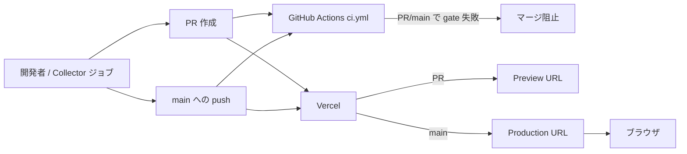

# Infrastructure Design — Unit 2 (Web Frontend)

**Project**: news.hako.tokyo
**Stage**: CONSTRUCTION — Infrastructure Design (depth: minimal)
**Created**: 2026-04-26

Unit 2 のインフラ設計を確定します。Unit 2 のインフラは **Vercel + GitHub Actions の CI** で構成されます。

---

## 1. インフラサービス選定サマリー

| カテゴリ | 採用 | 用途 |
|---|---|---|
| Hosting | **Vercel** | Next.js SSG ビルド + CDN 配信 |
| CI Runner | **GitHub Actions** (`ubuntu-latest`) | lint + typecheck + test + build + E2E + secrets スキャン + 依存スキャン |
| Storage | **GitHub リポジトリ** (`<repo-root>/content/*.md`) | Markdown データ (Unit 1 の出力 / Vercel ビルド時に読込) |
| CDN | **Vercel Edge Network** | 静的 HTML / CSS / JS / 画像配信 |
| DNS | (任意、ユーザー設定) | カスタムドメイン (例: `news.hako.tokyo`) を Vercel に向ける |

**採用しないインフラ**: AWS / GCP / Azure / DB / API Gateway / WAF / 専用 CDN (Cloudflare 等)。

---

## 2. Vercel 設定

### 2.1 プロジェクト設定 (Vercel Dashboard で実施、IaC なし)

| 設定項目 | 値 | 根拠 |
|---|---|---|
| Framework Preset | Next.js | 自動検出 |
| Root Directory | `next/` | Q3=B、U2-NFR-DEPLOY-02 |
| Include source files outside the Root Directory | **ON** | `<repo-root>/content/` を読み込む必要があるため必須 |
| Build Command | (デフォルト = `next build`) | 既定で OK |
| Install Command | (デフォルト = `npm ci`) | 既定で OK |
| Output Directory | (デフォルト) | 既定で OK |
| Node.js Version | `.nvmrc` に従う (24.13.1) | actions/setup-node と整合 |
| Deployment Protection (Production) | **OFF** (公開) | Q4=A、U2-NFR-DEPLOY-04 |
| Deployment Protection (Preview) | **OFF** (無認証) | Q4=A |
| Production Branch | `main` | デフォルト |

### 2.2 `vercel.json` (任意ファイル)

Vercel Dashboard だけで設定すべて完結するため、**`vercel.json` は MVP では作成しない**。設定の一部をコード管理したい場合は将来追加可能 (例: `headers` カスタマイズ、redirect 設定等)。

### 2.3 環境変数 (Vercel Dashboard)

MVP では **環境変数の設定不要** (採用ソースは API キー不要、`CONTENT_DIR` も既定で OK)。

将来必要になった場合の例:
- `CONTENT_DIR`: `<repo-root>/content` 以外のパスを使う場合
- (将来) NewsAPI 等を追加する場合は `NEWSAPI_KEY` 等を Encrypted で登録

### 2.4 デプロイトリガ

| トリガ | 動作 |
|---|---|
| `main` ブランチへの push | Production デプロイ |
| PR 作成 / 更新 | Preview デプロイ (各 PR ごとに専用 URL) |
| Unit 1 collect ジョブの commit | `main` への push の一種 → Production デプロイされ、新しい記事が反映される |

---

## 3. CI ワークフロー: `.github/workflows/ci.yml`

PR と main push で実行される CI ワークフロー。

### 3.1 ファイル仕様

```yaml
name: ci
run-name: "CI (${{ github.event_name }})"

on:
  push:
    branches: [main]
  pull_request: {}

concurrency:
  group: ci-${{ github.ref }}
  cancel-in-progress: true

permissions:
  contents: read

jobs:
  static-checks:
    runs-on: ubuntu-latest
    timeout-minutes: 10
    defaults:
      run:
        working-directory: next
    steps:
      - uses: actions/checkout@v4
      - uses: actions/setup-node@v4
        with:
          node-version-file: ".nvmrc"
          cache: npm
          cache-dependency-path: next/package-lock.json
      - run: npm ci
      - run: npm run lint
      - run: npx tsc --noEmit
      - run: npm run test:run

  build:
    runs-on: ubuntu-latest
    timeout-minutes: 10
    needs: static-checks
    defaults:
      run:
        working-directory: next
    steps:
      - uses: actions/checkout@v4
      - uses: actions/setup-node@v4
        with:
          node-version-file: ".nvmrc"
          cache: npm
          cache-dependency-path: next/package-lock.json
      - run: npm ci
      - run: npm run build

  e2e:
    runs-on: ubuntu-latest
    timeout-minutes: 15
    needs: build
    defaults:
      run:
        working-directory: next
    steps:
      - uses: actions/checkout@v4
      - uses: actions/setup-node@v4
        with:
          node-version-file: ".nvmrc"
          cache: npm
          cache-dependency-path: next/package-lock.json
      - run: npm ci
      - run: npm run test:e2e:install
      - run: npm run build
      - run: npm run test:e2e

  gitleaks:
    runs-on: ubuntu-latest
    timeout-minutes: 5
    steps:
      - uses: actions/checkout@v4
        with:
          fetch-depth: 0
      - uses: gitleaks/gitleaks-action@v2
        env:
          GITHUB_TOKEN: ${{ secrets.GITHUB_TOKEN }}

  npm-audit:
    runs-on: ubuntu-latest
    timeout-minutes: 5
    continue-on-error: true   # U1-NFR-SEC-05: 警告通知のみ
    defaults:
      run:
        working-directory: next
    steps:
      - uses: actions/checkout@v4
      - uses: actions/setup-node@v4
        with:
          node-version-file: ".nvmrc"
          cache: npm
          cache-dependency-path: next/package-lock.json
      - run: npm ci
      - run: npm audit --audit-level=moderate
```

### 3.2 ジョブ構成の根拠

| ジョブ | gate? | 理由 |
|---|---|---|
| `static-checks` (lint + typecheck + test) | ✅ Gate | U2-NFR-CI-01〜03、Unit 1 の test 含む全 PBT も実行 |
| `build` | ✅ Gate | U2-NFR-CI-04、ビルドが通ることを保証 |
| `e2e` | ✅ Gate | U2-NFR-CI-05、Playwright で local `next start` を叩く |
| `gitleaks` | ✅ Gate | U1-NFR-SEC-06、secrets 漏洩は致命 |
| `npm-audit` | ⚠️ 警告のみ | U1-NFR-SEC-05、`continue-on-error: true` |

### 3.3 concurrency

- `group: ci-${{ github.ref }}` で同じブランチ / PR の重複実行を制御
- `cancel-in-progress: true` で古い実行をキャンセル (CI コスト削減)

### 3.4 permissions

- 全ジョブ: `contents: read` のみ (CI なので write 不要)
- gitleaks のみ `GITHUB_TOKEN` を Action 内で使用 (デフォルトの read で十分)

---

## 4. Vercel と GitHub Actions の関係



### Text Alternative
- 開発者 (もしくは Unit 1 の collect ジョブ) が PR / main push する
- GitHub Actions の `ci.yml` が起動 (lint + typecheck + test + build + E2E + gitleaks + npm audit)
- 同時に Vercel が PR の Preview デプロイ / main の Production デプロイを開始
- CI が失敗すると PR マージ不可 (GitHub の branch protection で別途設定推奨)
- Vercel の Production URL に新しい記事が反映される

---

## 5. ロールバック戦略

| 失敗ケース | ロールバック手段 |
|---|---|
| Vercel ビルド失敗 (frontmatter スキーマ違反等) | Vercel が **前回成功ビルドを維持**、ユーザー操作不要 |
| 不正な `content/*.md` がコミットされた | `git revert` で該当コミット取消 → 再 push → Vercel が再ビルド |
| CI 失敗 (lint / typecheck / test / E2E / gitleaks) | PR を merge せず修正、main に到達させない |
| 重大な UI バグが本番に到達 | Vercel Dashboard の "Promote to Production" で過去の成功 deployment を再ロール |

---

## 6. リソース見積り

| 項目 | 推定値 | 制限 |
|---|---|---|
| Vercel 月間ビルド時間 | 30 秒 × 1 日 1〜2 回 ≒ **15〜30 分/月** | Hobby プラン: 6,000 分/月 |
| Vercel 月間帯域 | 個人利用 (1 日数十アクセス) | Hobby プラン: 100 GB/月 |
| GitHub Actions CI | 5 分 × PR + main push (週 5〜10 回) ≒ **30〜60 分/月** | Free プラン: 2,000 分/月 (private) / 無制限 (public) |
| GitHub Actions Collect (Unit 1) | 1〜2 分 × 1 日 ≒ **30〜60 分/月** | 同上 |
| **合計** | < 200 分/月 | すべて余裕の枠内 |

---

## 7. SECURITY コンプライアンス再確認

| ID | 対応 |
|---|---|
| U2-NFR-SEO-01 (`robots.txt`) | `next/public/robots.txt` (Code Generation で配置) |
| External Link Hardening | UI コンポーネント実装で `rel="noopener noreferrer"` を必ず付与 |
| Vercel Authentication | OFF (Q4=A) |
| Secrets スキャン | gitleaks (`.github/workflows/ci.yml`) |
| 依存脆弱性スキャン | npm audit (warn only) |
| Permissions 最小化 | `contents: read` (CI)、Vercel は OAuth 経由のため追加 token 不要 |

---

## 8. 拡張機能コンプライアンス サマリー (本ステージ)

### Security Baseline
- 全 N/A (拡張機能 無効)
- 代替最小ガード:
  - SEARCH ENGINE EXCLUSION: `robots.txt`
  - SECRETS SCANNING: gitleaks (CI gate)
  - DEPENDENCY SCANNING: npm audit (notify)
  - LEAST PRIVILEGE CI: `permissions: contents: read`

### PBT (Partial)
- 本ステージ対象外 (Code Generation / Build and Test で評価)
