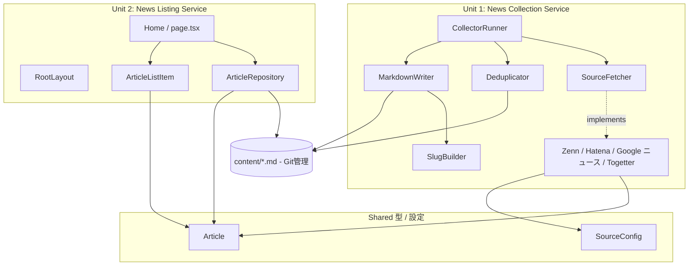

# Application Design (Consolidated)

**Project**: news.hako.tokyo
**Stage**: INCEPTION — Application Design
**Depth**: Standard
**Created**: 2026-04-25

本ドキュメントは Application Design の **統合サマリー** です。詳細は分割ドキュメントを参照してください。

| 詳細ドキュメント | 内容 |
|---|---|
| [components.md](./components.md) | コンポーネント定義と責務 |
| [component-methods.md](./component-methods.md) | メソッドシグネチャと入出力型 |
| [services.md](./services.md) | サービス層オーケストレーション |
| [component-dependency.md](./component-dependency.md) | 依存関係マトリクス、通信パターン、データフロー |

---

## 1. 設計判断サマリー (Application Design Plan の回答)

| Q | テーマ | 判断 |
|---|---|---|
| Q1 | Source Fetcher の抽象化 | **A**: Adapter パターン (`SourceFetcher<TConfig>` interface + 4 実装) |
| Q2 | `Article` フィールド | **A,B,C,D,E,F,G,H,J**: id / title / url / source / publishedAt / collectedAt / summary / tags / thumbnailUrl (`author` 除外) |
| Q3 | Markdown ファイル名規約 | **A**: `{publishedAt(YYYY-MM-DD)}-{slug-from-title}.md` |
| Q4 | Collector 実行戦略 | **A**: 逐次実行 + 失敗継続 |
| Q5 | 重複排除キー | **A**: `url` のみ |
| Q6 | Markdown 読み込み層の責務 | **A**: 読み込み + パースのみ (ソートは呼び出し側) |

---

## 2. アーキテクチャ概要

### Text Alternative
- 共有層: `Article` 型と `SourceConfig` を Unit 1 / Unit 2 双方が参照
- Unit 1 (Collector): `CollectorRunner` が `SourceFetcher` 実装群を呼び出し、`Deduplicator` で重複排除、`MarkdownWriter` で `content/` に書き出す
- Unit 2 (Web): `Home` (page) が `ArticleRepository` 経由で `content/` から読み込み、`ArticleListItem` で描画
- 両 Unit は `content/*.md` を共有データレイヤとして連携

---

## 3. 設計の要点

### 3.1 Adapter パターン (Q1=A)
- `SourceFetcher<TConfig>` 共通インターフェイスを採用。ソース追加 (例: GitHub Trending, Reddit 等) は新規 Adapter を 1 つ追加するだけで対応可能。
- 既存 Adapter のテストや CollectorRunner の変更を伴わない。

### 3.2 Article 型のフィールド設計 (Q2)
- 表示用フィールド (`title`, `url`, `source`, `publishedAt`, `collectedAt`) に加え、**将来要約機能のために `summary` を保持**。
- **`author` は除外**: 個人ニュースリーダーで著者名の表示は MVP 必須ではなく、ソースによって取得方法・粒度が異なるため見送り。
- **`tags` を保持**: 将来の絞り込み機能の前準備。MVP では空配列で OK。
- **`thumbnailUrl` を保持**: 将来の表示拡張用。`null` 許容。

### 3.3 Markdown ファイル名規約 (Q3=A)
- `{publishedAt(YYYY-MM-DD)}-{slug-from-title}.md`
- 利点: ディレクトリ表示で時系列順に並ぶため、Git 上での視認性が高い。
- 注意: 同日同 slug の衝突は短いハッシュサフィックスで回避 (`MarkdownWriter` の責務)。

### 3.4 逐次実行 + 失敗継続 (Q4=A)
- ソース 1 つの障害が全体停止につながらない (= 1 日 1 回しか動かない MVP において信頼性確保)。
- 並列より遅いが、4 ソース程度ならジョブ全体は数分以内に収まる見込み (NFR-06 / GitHub Actions 無料枠と整合)。
- デバッグ時に問題ソースを特定しやすい (ログがソース順)。

### 3.5 URL ベース重複排除 (Q5=A)
- 最もシンプル。RSS / Atom (Zenn・はてブ・Google ニュース) のすべてが `link` / `url` を提供するため適用範囲が広い。Togetter スクレイピングでも URL を抽出可能。
- **将来課題 (RISK-05)**: クエリパラメータの違いやリダイレクトでの URL 変化への対応は、`Deduplicator` を差し替えポイントとして実装することで後日対応可能 (component-dependency.md §6 参照)。

### 3.6 Repository の最小責務 (Q6=A)
- ソート / フィルタを `Home` 側に置くことで、データアクセス層は **副作用なしの純粋な変換** に近づく → テスト容易。
- 将来に絞り込み API を追加したくなった際は、`Home` 側に閉じ込めるか、Repository に `getFilteredArticles()` を追加する余地を残す。

---

## 4. ユニット境界の確認

### Unit 1: News Collection Service (`scripts/collector/`)
- メンバ: `CollectorRunner`, `SourceFetcher` IF, 4 Adapter 実装, `Deduplicator`, `MarkdownWriter`, `SlugBuilder`, `SourceConfig`
- 実行コンテキスト: GitHub Actions (Node.js)
- 出力: `content/*.md` (git commit & push 経由)

### Unit 2: News Listing Service (`next/`)
- メンバ: `Home`, `RootLayout`, `ArticleListItem`, `ArticleRepository`
- 実行コンテキスト: Next.js ビルド (Vercel)
- 出力: 静的 HTML / CSS / JS

### Cross-cutting
- `Article` / `Source` / `SourceConfig` 型は両ユニット共有 (実装場所は Construction で確定。候補: リポジトリルートに `lib/article.ts` を置き、両側から import する)

---

## 5. PBT (Partial) 適用先のプレビュー

NFR フェーズ (per-unit) で詳細を詰めるが、現時点で以下を想定:

| Component | PBT カテゴリ | 内容 |
|---|---|---|
| `MarkdownWriter` ↔ `ArticleRepository` | PBT-02 (Round-trip) | `Article → Markdown → Article` で同値 |
| `Deduplicator.filterNew` | PBT-03 (Invariant) | 出力配列の URL は一意、出力件数 ≤ 入力件数、入力にあった重複しない URL は必ず出力に含まれる |
| `SlugBuilder.build` | PBT-03 (Invariant) | 出力は `[a-z0-9-]+` のみ、長さ ≤ 50、空文字を返さない |
| ドメイン型 generators | PBT-07 (Generator quality) | `Article` / `RssItem` (Zenn / Hatena / Google ニュース 共通) / `TogetterEntry` の fast-check arbitrary を共通モジュールで定義 |
| 全 PBT | PBT-08 (Shrinking + Reproducibility) | seed ログを CI に出力 |
| Framework | PBT-09 (Framework Selection) | fast-check + Vitest (確定済み — NFR-04) |

> Q19=B (Partial) のため、PBT-04, 05, 06, 10 は advisory (非ブロッキング)。

---

## 6. Open Questions の引き継ぎ

実行計画 (workflow planning) で挙げた 5 つの Open Questions のうち、本設計で部分的に解消したもの:

| OQ | 内容 | 本設計での扱い |
|---|---|---|
| OQ-01 | Togetter スクレイピングの規約・robots.txt 確認 | NFR Requirements (Unit 1) で確認 (本設計では `enabled: boolean` フラグで切替可能にしている) |
| OQ-02 | 一般ニュースのソース選定 (NewsAPI vs RSS) | **解消済み**: Google ニュースの非公式 RSS を採用 (API キー不要)。`GoogleNewsRssFetcher` を Adapter として用意。Functional Design (Unit 1) で具体的なクエリ / トピック / 地理パラメータを確定。 |
| OQ-03 | Vercel preview URL の E2E 取り回し | Infrastructure Design (Unit 2) または Build and Test |
| OQ-04 | Markdown frontmatter スキーマ詳細 | **本設計で確定** (Article 型として定義済み) |
| OQ-05 | Next.js 16 breaking changes の影響 | Functional Design (Unit 2) で `node_modules/next/dist/docs/` を参照しつつ確定 |

---

## 7. 拡張機能コンプライアンス (本ステージ)

### Security Baseline
- すべて **N/A** (拡張機能は Q18=B により無効)

### PBT (Partial)
| Rule | 評価 | コメント |
|---|---|---|
| PBT-01 (Property Identification) | Advisory | Functional Design で「Testable Properties」セクションを各コンポーネントに追加することを推奨 (Partial では非ブロッキング) |
| PBT-09 (Framework Selection) | ✅ 準拠 | fast-check + Vitest を文書に明記済 |
| PBT-02, 03, 07, 08 | 後続ステージで評価 | Functional Design / Code Generation で適用 |
| PBT-04, 05, 06, 10 | N/A (Partial mode) | — |

---

## 8. Construction フェーズへの引き継ぎ

Construction では本設計を起点に、ユニット単位で以下を確定する:

### Unit 1 (Collector) Construction Stage プレビュー
1. **Functional Design**: 各 Adapter のフィールドマッピング詳細、frontmatter YAML スキーマ確定、エラーログフォーマット、Testable Properties (PBT-01 advisory)
2. **NFR Requirements**: Vitest / fast-check / cheerio (or rss-parser) 等の依存ライブラリ選定、cron 実行時間枠、Togetter 規約確認 (OQ-01)、Google ニュース RSS 仕様の安定性・代替プラン (RISK-02 更新版)
3. **NFR Design**: PBT-02/03/07/08 の具体テストパターン
4. **Infrastructure Design (minimal)**: GitHub Actions ワークフロー (`.github/workflows/collect.yml`) の cron / permissions / secrets / git commit 戦略
5. **Code Generation**: Adapter, Runner, Deduplicator, Writer, SlugBuilder の実装

### Unit 2 (Web) Construction Stage プレビュー
1. **Functional Design**: ArticleRepository 詳細 (gray-matter / zod 等の選定確認)、ArticleListItem の表示仕様、空状態 UI、Next.js 16 の SSG 仕様確認 (OQ-05)
2. **NFR Requirements**: Vitest / Playwright / Tailwind v4 ダークモード設定の確認
3. **NFR Design**: PBT-02 (frontmatter ↔ Article ラウンドトリップ) の Repository 側パターン
4. **Infrastructure Design (minimal)**: `vercel.json` (必要時) と CI ワークフロー (`.github/workflows/ci.yml`)
5. **Code Generation**: Page, Layout, Component, Repository の実装
