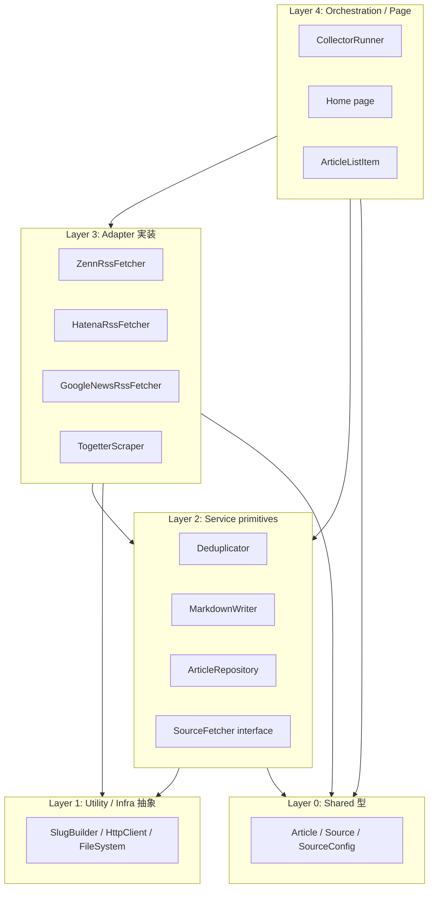

# Component Dependency

**Project**: news.hako.tokyo
**Stage**: INCEPTION — Application Design
**Depth**: Standard

コンポーネント間の依存関係マトリクス、通信パターン、データフローを示します。

---

## 1. Dependency Matrix

行 = 依存元、列 = 依存先 (`✓` = 依存あり、`-` = 無し)

| from \\ to | Article | Source ID | SourceConfig | Home | RootLayout | ArticleListItem | ArticleRepository | CollectorRunner | SourceFetcher (IF) | ZennRssFetcher | HatenaRssFetcher | GoogleNewsRssFetcher | TogetterScraper | Deduplicator | MarkdownWriter | SlugBuilder | content/ | HttpClient | FileSystem |
|---|---|---|---|---|---|---|---|---|---|---|---|---|---|---|---|---|---|---|---|
| **Article** | - | ✓ | - | - | - | - | - | - | - | - | - | - | - | - | - | - | - | - | - |
| **Source ID** | - | - | - | - | - | - | - | - | - | - | - | - | - | - | - | - | - | - | - |
| **SourceConfig** | - | - | - | - | - | - | - | - | - | - | - | - | - | - | - | - | - | - | - |
| **Home** | ✓ | - | - | - | - | ✓ | ✓ | - | - | - | - | - | - | - | - | - | - | - | - |
| **RootLayout** | - | - | - | - | - | - | - | - | - | - | - | - | - | - | - | - | - | - | - |
| **ArticleListItem** | ✓ | - | - | - | - | - | - | - | - | - | - | - | - | - | - | - | - | - | - |
| **ArticleRepository** | ✓ | - | - | - | - | - | - | - | - | - | - | - | - | - | - | - | ✓ (read) | - | ✓ |
| **CollectorRunner** | ✓ | ✓ | ✓ | - | - | - | - | - | ✓ | (✓) | (✓) | (✓) | (✓) | ✓ | ✓ | - | - | - | - |
| **SourceFetcher (IF)** | ✓ | ✓ | - | - | - | - | - | - | - | - | - | - | - | - | - | - | - | - | - |
| **ZennRssFetcher** | ✓ | ✓ | ✓ (ZennConfig) | - | - | - | - | - | ✓ implements | - | - | - | - | - | - | - | - | ✓ | - |
| **HatenaRssFetcher** | ✓ | ✓ | ✓ (HatenaConfig) | - | - | - | - | - | ✓ implements | - | - | - | - | - | - | - | - | ✓ | - |
| **GoogleNewsRssFetcher** | ✓ | ✓ | ✓ (GoogleNewsConfig) | - | - | - | - | - | ✓ implements | - | - | - | - | - | - | - | - | ✓ | - |
| **TogetterScraper** | ✓ | ✓ | ✓ (TogetterConfig) | - | - | - | - | - | ✓ implements | - | - | - | - | - | - | - | - | ✓ | - |
| **Deduplicator** | ✓ | - | - | - | - | - | - | - | - | - | - | - | - | - | - | - | ✓ (read) | - | ✓ |
| **MarkdownWriter** | ✓ | - | - | - | - | - | - | - | - | - | - | - | - | - | - | ✓ | ✓ (write) | - | ✓ |
| **SlugBuilder** | - | - | - | - | - | - | - | - | - | - | - | - | - | - | - | - | - | - | - |

凡例:
- `(✓)` = `CollectorRunner` は具体的な fetcher 実装ではなく `SourceFetcher` インターフェイスに依存。Adapter インスタンスは合成時に注入される。
- `content/` への依存は read / write を区別して表記
- `HttpClient` / `FileSystem` は DI 抽象 (テスト時はモック)

---

## 2. レイヤー間の依存方向 (健全性チェック)



### Text Alternative
- レイヤー 4 (Orchestration / Page) はレイヤー 0〜3 のすべてに依存できる。
- レイヤー 3 (Adapter) はレイヤー 0 / 1 / 2 (interface のみ) に依存。
- レイヤー 2 (Service primitives) はレイヤー 0 / 1 に依存。
- レイヤー 0 (Shared 型) は他の何にも依存しない。

**循環依存はなし**。Adapter パターンによって、Orchestrator (CollectorRunner) は具象実装ではなく interface に依存するため、テスト容易性 (モック注入) が確保される。

---

## 3. Communication Patterns

### 3.1 In-Process 関数呼び出し
- ほぼすべてのコンポーネント間通信は **TypeScript 関数呼び出し** で完結 (Promise ベースの非同期含む)。
- 例: `Home → ArticleRepository → fs.readFile`、`CollectorRunner → SourceFetcher.fetch`

### 3.2 ファイルシステム通信
- `MarkdownWriter` (write) と `Deduplicator` / `ArticleRepository` (read) は `content/` ディレクトリを共有メディアとして利用
- これは **「データ結合」** であり、frontmatter スキーマが暗黙の API 契約

### 3.3 HTTP 通信 (外部)
- `*Fetcher` 系は `HttpClient` 抽象経由で外部 (Zenn, Hatena, Google ニュース, Togetter) に HTTP GET
- API キー等は環境変数経由で `*Fetcher` のコンストラクタへ注入

### 3.4 プロセス境界
- **Collector プロセス** (Node.js, GitHub Actions 上で実行) と **Web ビルドプロセス** (Next.js, Vercel 上で実行) は完全に別プロセス
- 両者は git リポジトリの `content/` を介してのみ連携 (前述)

---

## 4. Data Flow Diagrams

### 4.1 Collector の入出力

```mermaid
flowchart LR
    Z[Zenn RSS<br/>HTTPS] -->|XML| ZF[ZennRssFetcher]
    H[Hatena RSS<br/>HTTPS] -->|XML| HF[HatenaRssFetcher]
    NA[Google ニュース 非公式 RSS<br/>HTTPS APIキー不要] -->|XML| NF[GoogleNewsRssFetcher]
    TG[Togetter<br/>HTTPS HTML] -->|HTML| TF[TogetterScraper]

    ZF -->|Article[]| RUN[CollectorRunner]
    HF -->|Article[]| RUN
    NF -->|Article[]| RUN
    TF -->|Article[]| RUN

    EXIST[(content/ 既存 *.md)] -->|frontmatter| DED[Deduplicator]
    RUN -->|all fetched| DED
    DED -->|new only| RUN
    RUN -->|new + collectedAt| MW[MarkdownWriter]
    MW -->|*.md| OUT[(content/ 新規 *.md)]
```

### Text Alternative
- 入力: Zenn / Hatena / Google ニュース / Togetter からの HTTP レスポンス + 既存の `content/*.md`
- Adapter が共通の `Article[]` に正規化
- Runner が新規分のみに絞り込み、`collectedAt` を付与
- Writer が `content/` に新規 Markdown ファイルを書き出し

### 4.2 Web の入出力

```mermaid
flowchart LR
    SRC[(content/*.md)] -->|read at build| REPO[ArticleRepository]
    REPO -->|Article[]| HOME[Home page]
    HOME -->|sort + map| ITEM[ArticleListItem]
    ITEM -->|HTML element| HTML[(静的 HTML / Vercel CDN)]
    HTML -->|HTTPS| BR[ブラウザ]
```

### Text Alternative
- 入力: ビルド時の `content/*.md`
- Repository が Article 配列にパース → Home がソート → ArticleListItem で描画 → 静的 HTML 出力 → ブラウザ

---

## 5. 結合度評価

| 関係 | 結合タイプ | 評価 |
|---|---|---|
| Home ↔ ArticleRepository | データ + 関数呼び出し | ✅ 適切 (Repository が抽象インターフェイス相当) |
| CollectorRunner ↔ Adapter 実装 | interface (Adapter パターン) | ✅ 良好 (具象に依存しない、新規ソース追加容易) |
| Adapter ↔ HttpClient | interface | ✅ 良好 (テスト容易) |
| Web ↔ Collector | データ結合 (Markdown frontmatter) | ✅ 良好 (時間/通信結合なし、独立デプロイ可能) |
| Adapter ↔ SourceConfig 型 | 部分依存 (`SourceConfig.zenn` 等) | ✅ 適切 (各 Adapter が必要な部分のみを受け取る形に Runner が分配) |
| Deduplicator ↔ MarkdownWriter | 双方向の依存なし | ✅ 良好 (Runner が両者を仲介) |

---

## 6. Testability の観点

| Component | テスト戦略 (PBT 含む方針) |
|---|---|
| `Article` 型 | 型のみのため、test 対象外。ただし zod 等のスキーマ定義に対しては PBT-02 (frontmatter ↔ Article ラウンドトリップ) を適用 |
| `ArticleRepository` | `FileSystem` をモックして単体テスト。実 fs を用いたゴールデンファイルテストも 1 つ用意 |
| `Deduplicator` | PBT-03 (filterNew の出力 URL 一意性、入力件数 >= 出力件数) を適用 |
| `MarkdownWriter` | PBT-02 (Article → Markdown → re-parse → Article ラウンドトリップ) を適用 |
| `SlugBuilder` | PBT-03 (出力が `[a-z0-9-]+` を満たす不変条件、長さ ≤ 50) を適用 |
| 各 `*Fetcher` | `HttpClient` をモックし、実 RSS/JSON/HTML サンプルを fixture として用意。PBT-07 のドメイン型ジェネレータで RSS XML を生成し、PBT-02 (XML → Article のマッピング不変条件) を任意で適用 (Partial モードでは advisory) |
| `CollectorRunner` | 全依存をモックし、逐次実行 + 失敗継続のシナリオを統合テスト |
| `Home` / `ArticleListItem` | Playwright で E2E (一覧表示、リンク target/rel、ダーク/ライト切替) |
