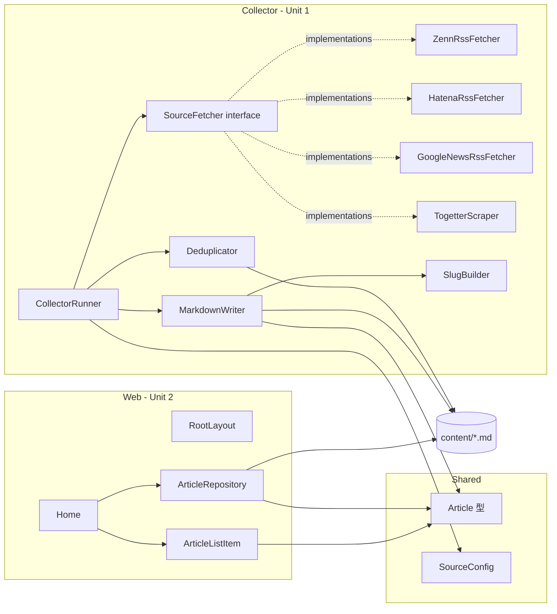

# Components

**Project**: news.hako.tokyo
**Stage**: INCEPTION — Application Design
**Depth**: Standard

このドキュメントは、本プロジェクトを構成するコンポーネントの **責務** と **インターフェイスの概要** を定義します。詳細なメソッドシグネチャは `component-methods.md`、サービスのオーケストレーションは `services.md` を参照してください。

> **注意**: ファイルパスは Application Design における **論理パス** です。物理ファイル名は Code Generation で確定します。

---

## 1. Component Map (論理レイヤ)

| Layer | Components | 配置場所 (論理) | 所属ユニット |
|---|---|---|---|
| **Shared** | `Article`, `Source`, `SourceConfig` | `lib/article.ts`, `config/sources.ts` | Cross-cutting |
| **Web** | `Home`, `RootLayout`, `ArticleListItem`, `ArticleRepository` | `next/app/`, `next/lib/` | Unit 2 (Web Frontend) |
| **Collector — Orchestration** | `CollectorRunner`, `Deduplicator`, `MarkdownWriter`, `SlugBuilder` | `scripts/collector/`, `scripts/collector/lib/` | Unit 1 (Collector) |
| **Collector — Adapters** | `SourceFetcher` (interface), `ZennRssFetcher`, `HatenaRssFetcher`, `GoogleNewsRssFetcher`, `TogetterScraper` | `scripts/collector/sources/` | Unit 1 (Collector) |

---

## 2. Shared Components

### 2.1 `Article` (型定義)
- **Purpose**: 1 件のニュース記事を表す唯一の正準型。Web と Collector の両方で参照される。
- **Responsibilities**:
  - 記事 1 件の必須フィールド (id, title, url, source, publishedAt, collectedAt, summary, tags, thumbnailUrl) を表現
  - フィールドはすべて TypeScript で型付けされる
- **Interface**: `interface Article { ... }`
- **Q2 で確定したフィールド** (`author` は除外):
  - `id: string` — URL から決定的に生成 (重複排除のキーは url のため、id は本質的に url の派生)
  - `title: string`
  - `url: string`
  - `source: SourceId` (`"zenn" | "hatena" | "googlenews" | "togetter"`)
  - `publishedAt: string` (ISO 8601)
  - `collectedAt: string` (ISO 8601)
  - `summary: string` — RSS の description 等、ソース由来の冒頭抜粋 (将来の要約機能のため保持)
  - `tags: string[]` — 将来の絞り込み用 (空配列で OK)
  - `thumbnailUrl: string | null` — 取得不能時は `null`

### 2.2 `Source` (列挙)
- **Purpose**: 取り扱い可能なソースの一意識別子。
- **Interface**: `type SourceId = "zenn" | "hatena" | "googlenews" | "togetter"`

### 2.3 `SourceConfig` (収集対象設定)
- **Purpose**: 各ソースの取得設定 (RSS URL リスト、API クエリ、スクレイピング対象 URL 等) を保持する設定値。
- **Responsibilities**:
  - ソースごとの取得設定の宣言的記述
  - `config/sources.ts` で TypeScript として export し Git 管理 (Clarification Q4 = A)
- **Interface**:
  - `interface SourceConfig { zenn: ZennConfig; hatena: HatenaConfig; googlenews: GoogleNewsConfig; togetter: TogetterConfig; }`

---

## 3. Web Components (Unit 2)

### 3.1 `Home` (`next/app/page.tsx`)
- **Purpose**: ルート URL `/` で記事一覧を表示する Next.js ページ。
- **Responsibilities**:
  - ビルド時 (SSG) に `ArticleRepository.getAllArticles()` を呼び出す
  - 取得した記事配列を **新着順** に並び替える (Q6 = A により `Home` 側でソート)
  - 各記事を `ArticleListItem` で描画する
- **Interface**: React Server Component (引数なし、`JSX.Element` を返す)

### 3.2 `RootLayout` (`next/app/layout.tsx`)
- **Purpose**: HTML 骨格、フォント、グローバル CSS の取り込み。
- **Responsibilities**:
  - 既存の Geist フォント / Tailwind 統合を維持
  - メタデータをプロダクトに合わせて更新 (`title: "news.hako.tokyo"` 等)
  - `<html lang="ja">` に変更 (i18n 日本語のみ)
  - システム設定追従のダークモード対応 (Tailwind v4 のメディアクエリ)
- **Interface**: React Server Component

### 3.3 `ArticleListItem` (`next/components/article-list-item.tsx`)
- **Purpose**: 記事 1 件分を一覧上に表示する Presentational コンポーネント。
- **Responsibilities**:
  - タイトル / ソース / 公開日 / 元記事リンクを描画
  - 元記事リンクは `target="_blank"` + `rel="noopener noreferrer"` で開く (FR-01)
  - ライト / ダーク両対応のスタイリング (FR-05)
- **Interface**: `(props: { article: Article }) => JSX.Element`

### 3.4 `ArticleRepository` (`next/lib/articles.ts`)
- **Purpose**: ビルド時に `content/` 配下の Markdown を読み込み、`Article[]` として提供するデータアクセス層。
- **Responsibilities** (Q6 = A により最小スコープ):
  - `content/` ディレクトリを再帰スキャンし、Markdown ファイル一覧を取得
  - 各ファイルの frontmatter を解析して `Article` 型にマップ
  - エラー時は適切な例外を投げる (個別ファイル失敗ではビルド中断、データ不整合は早期検知)
- **Non-responsibilities**: ソート、フィルタ、ページング (呼び出し側が担当)
- **Interface**: `getAllArticles(): Promise<Article[]>` (または同期版)

---

## 4. Collector Components (Unit 1)

### 4.1 `CollectorRunner` (`scripts/collector/index.ts`)
- **Purpose**: 収集ジョブのエントリーポイント。Adapter 群を順に呼び出し、重複排除し、Markdown として書き出す全体オーケストレーション。
- **Responsibilities**:
  - 設定 (`config/sources.ts`) を読み込む
  - 既存 Markdown 群を `Deduplicator` 初期化のために読み込む
  - 各 `SourceFetcher` 実装を **逐次** で呼び出す (Q4 = A)
  - 各 fetcher の失敗時、エラーログを出して **次のソースへ継続** (Q4 = A)
  - 取得結果から重複 (URL ベース) を除外 (Q5 = A)
  - 残った新規記事を `MarkdownWriter` で書き出す
  - 最終的にサマリー (取得件数 / 重複件数 / 失敗ソース) を stdout に出力
- **Interface**: `run(): Promise<CollectorResult>`

### 4.2 `SourceFetcher` (interface, `scripts/collector/sources/source-fetcher.ts`)
- **Purpose**: 各ソース実装が満たすべき共通契約 (Adapter パターン、Q1 = A)。
- **Responsibilities**:
  - 自分のソース ID を返す
  - 自分の設定スライスを受け取り、`Article[]` を返す
- **Interface**:
  ```typescript
  interface SourceFetcher<TConfig> {
    readonly source: SourceId;
    fetch(config: TConfig): Promise<Article[]>;
  }
  ```

### 4.3 `ZennRssFetcher` (`scripts/collector/sources/zenn-rss-fetcher.ts`)
- **Purpose**: Zenn の RSS フィードから記事を取得する Adapter。
- **Responsibilities**:
  - `ZennConfig.feedUrls` の各 URL を取得 (HTTP GET)
  - `<rss><channel><item>` を解析し、`Article` 型にマップ
  - 失敗時は呼び出し元へ Promise reject

### 4.4 `HatenaRssFetcher` (`scripts/collector/sources/hatena-rss-fetcher.ts`)
- **Purpose**: はてなブックマークの RSS フィード (Hot Entry, カテゴリ RSS 等) から記事を取得する Adapter。
- **Responsibilities**: Zenn と同等の RSS パース処理 (内部で共通の RSS パーサユーティリティを利用してもよい)。

### 4.5 `GoogleNewsRssFetcher` (`scripts/collector/sources/google-news-rss-fetcher.ts`)
- **Purpose**: Google ニュースの非公式 RSS から記事を取得する Adapter。
- **Responsibilities**:
  - `GoogleNewsConfig` の `queries` (キーワード検索) / `topics` (トピック別) / `geos` (地域別) を構築し、`https://news.google.com/...` の RSS URL をそれぞれ HTTP GET
  - 言語/地域は `hl=ja&gl=JP&ceid=JP:ja` を既定とし、必要に応じて override 可能
  - レスポンス XML を解析し `Article` 型にマップ
  - **API キー不要** (シークレット環境変数の依存なし)
  - **非公式仕様の不安定性 (RISK-02 更新版)** を踏まえ、エラーログを残し失敗継続戦略 (Q4=A) に委譲

### 4.6 `TogetterScraper` (`scripts/collector/sources/togetter-scraper.ts`)
- **Purpose**: Togetter の Web ページをスクレイピングして記事 (まとめ) を取得する Adapter。
- **Responsibilities**:
  - 利用規約および `robots.txt` 確認後に有効化 (RISK-01 / OQ-01 を Construction で解消)
  - HTML パース (例: `cheerio`) でまとめタイトル / 公開日 / URL を抽出
  - リクエスト頻度を控えめにする (例: 取得対象は限定、間隔を空ける)

### 4.7 `Deduplicator` (`scripts/collector/lib/dedup.ts`)
- **Purpose**: 重複排除 (Q5 = A により URL のみで判定)。
- **Responsibilities**:
  - 既存 `content/` 配下の Markdown 群から URL のセットを構築
  - 新規取得 Article 配列のうち、未収集 URL のみを返す
  - **拡張余地**: `RISK-05` への将来対応 (URL 正規化 / 複合キー) の差し替えポイントとして単一クラスに閉じ込める

### 4.8 `MarkdownWriter` (`scripts/collector/lib/markdown-writer.ts`)
- **Purpose**: `Article` を Markdown ファイル (frontmatter 付き) に変換し、`content/` 配下に書き出す。
- **Responsibilities**:
  - ファイル名規約 (Q3 = A): `{publishedAt(YYYY-MM-DD)}-{slug-from-title}.md`
  - frontmatter は YAML 形式で `Article` 全フィールドを直列化
  - ファイル衝突時 (同名 slug) は短いハッシュサフィックスを付加して回避

### 4.9 `SlugBuilder` (`scripts/collector/lib/slug.ts`)
- **Purpose**: タイトルから URL safe な slug を生成するユーティリティ。
- **Responsibilities**:
  - 日本語タイトル → ローマ字変換または短縮 ASCII 化 (実装は Construction で確定)
  - 制限 (例: 50 文字以内、英数とハイフンのみ) を守る

---

## 5. コンポーネント概観 (Mermaid)



### Text Alternative
- Shared 層: `Article` 型 / `SourceConfig` 型 (Web と Collector の両方が依存)
- Web 層: `Home` → `ArticleRepository`、`Home` → `ArticleListItem`、`ArticleRepository` → `content/`
- Collector 層: `CollectorRunner` → `SourceFetcher` (4 実装) / `Deduplicator` / `MarkdownWriter` (→ `SlugBuilder`)
- 永続層: `content/*.md` を `MarkdownWriter` が書き、`Deduplicator` と `ArticleRepository` が読む

---

## 6. Component Inventory Summary

| Component | Type | Unit | Notes |
|---|---|---|---|
| `Article` | Type | Shared | 共有型定義 |
| `Source` (id 列挙) | Type | Shared | — |
| `SourceConfig` | Config | Shared | `config/sources.ts` |
| `Home` | Page (RSC) | Unit 2 | `app/page.tsx` |
| `RootLayout` | Layout (RSC) | Unit 2 | `app/layout.tsx` |
| `ArticleListItem` | Presentational | Unit 2 | `components/article-list-item.tsx` |
| `ArticleRepository` | Data Access | Unit 2 | `lib/articles.ts` |
| `CollectorRunner` | Orchestrator | Unit 1 | `scripts/collector/index.ts` |
| `SourceFetcher` | Interface | Unit 1 | Adapter 共通契約 |
| `ZennRssFetcher` | Adapter | Unit 1 | RSS |
| `HatenaRssFetcher` | Adapter | Unit 1 | RSS |
| `GoogleNewsRssFetcher` | Adapter | Unit 1 | RSS (非公式、API キー不要) |
| `TogetterScraper` | Adapter | Unit 1 | HTML スクレイピング (規約確認待ち) |
| `Deduplicator` | Service | Unit 1 | URL ベース重複排除 |
| `MarkdownWriter` | Service | Unit 1 | Article → Markdown |
| `SlugBuilder` | Utility | Unit 1 | タイトル → slug |
