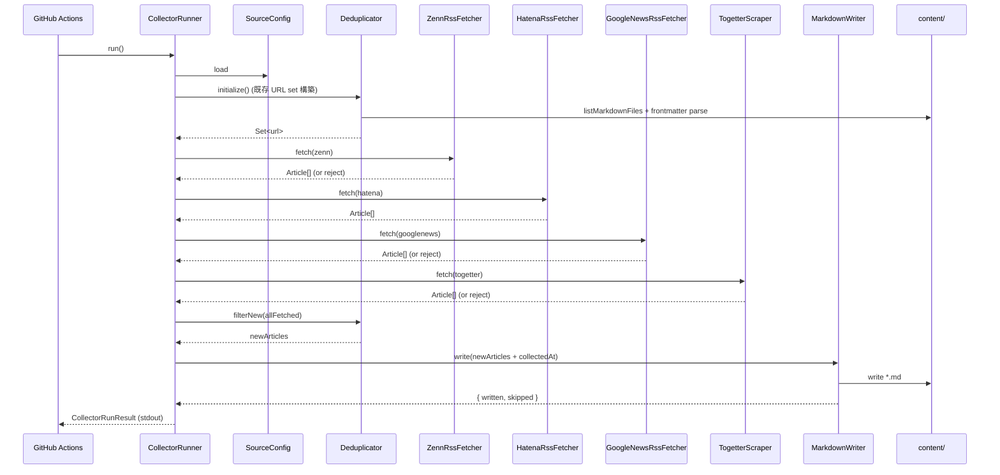
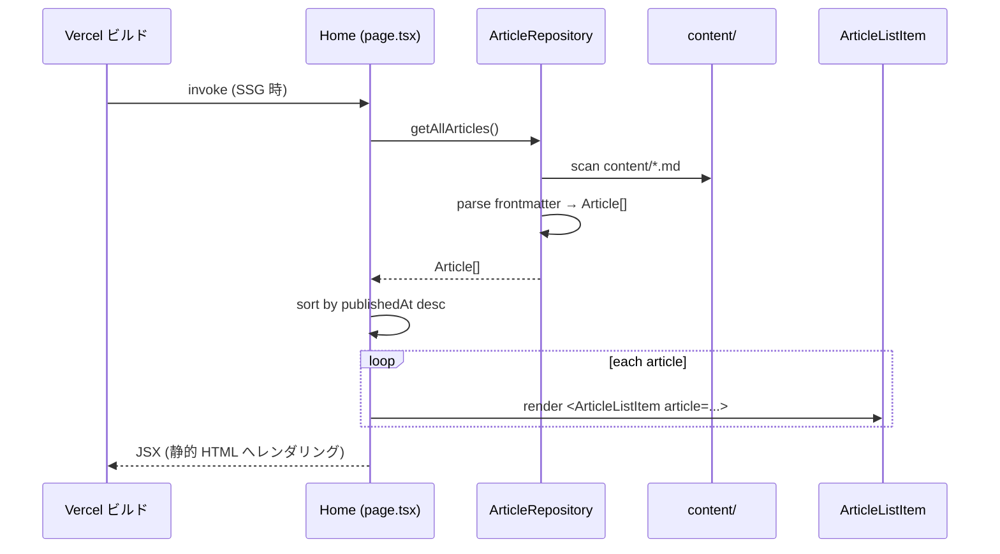
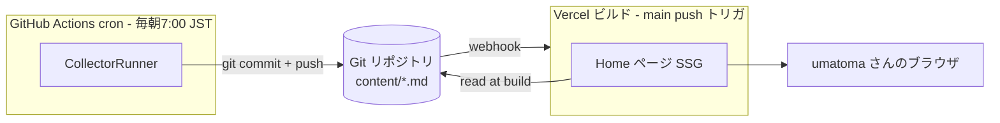

# Services

**Project**: news.hako.tokyo
**Stage**: INCEPTION — Application Design
**Depth**: Standard

「サービス」は、複数のコンポーネントを束ねて 1 つの目的を達成するオーケストレーション層を指します。本プロジェクトでは大きく **2 つのサービス境界** が存在します。

---

## 1. Service Catalog

| Service | 所属ユニット | エントリ | 実行コンテキスト | 責務 |
|---|---|---|---|---|
| **News Collection Service** | Unit 1 | `CollectorRunner.run()` | GitHub Actions (cron + workflow_dispatch)、ローカル実行も可 | 外部ソースから記事を収集し Markdown としてリポジトリにコミット |
| **News Listing Service** | Unit 2 | `Home` ページ (Next.js SSG) | Next.js ビルド時 (Vercel) | Markdown を読み込み、HTML 一覧ページとして静的生成 |

両サービスは **疎結合** で、`content/*.md` という **共有データレイヤ** (Git 管理の Markdown ファイル) を介してのみ連携します。

---

## 2. News Collection Service (Unit 1)

### 2.1 サービス境界
- **Inbound**: GitHub Actions の `schedule` (毎朝 7:00 JST) または `workflow_dispatch` (手動) による起動
- **Outbound**:
  - 外部 HTTP (Zenn / Hatena / Google ニュース / Togetter)
  - リポジトリの `content/` 配下への書き出し (実行後に git commit & push)
  - stdout (実行サマリー、GitHub Actions ログに残る)

### 2.2 オーケストレーション (CollectorRunner.run() の流れ)

### Text Alternative
1. GitHub Actions が `CollectorRunner.run()` を起動
2. `Deduplicator.initialize()` が `content/` 配下の全 frontmatter から URL Set を構築
3. 各 `SourceFetcher` を **逐次** 呼び出し。失敗したソースは `failedSources` に記録して継続 (Q4 = A)
4. 全取得 Article を `Deduplicator.filterNew()` で URL ベース重複排除 (Q5 = A)
5. 残った新規 Article に `collectedAt` を付与し、`MarkdownWriter` が `content/` に書き出す
6. `CollectorRunResult` を stdout へ出力 (GitHub Actions のログで監視)

### 2.3 失敗時の振る舞い

| 失敗ケース | 振る舞い |
|---|---|
| 単一 fetcher (例: Hatena) が失敗 | エラーログを出し、次のソースへ継続。`failedSources` に追加 |
| すべての fetcher が失敗 | 0 件書き出しで終了。プロセス exit code は 0 (= GitHub Actions 上は成功扱い)。サマリーで明示。 |
| Deduplicator または MarkdownWriter が失敗 | プロセス exit code 非 0。GitHub Actions のデフォルト失敗通知が走る (NFR-03 / FR-03 で MVP は最小限と合意済み) |
| 部分書き出し中にクラッシュ | 既に書き出した Markdown は残るが、git commit していなければ次回実行で重複検出されない可能性。**MVP では許容**。Construction で `git add` のタイミング (= 全書き出し完了後にまとめて) を確定。 |

> **将来検討事項**: 連続失敗時のリトライ、失敗ソースの Slack/Email 通知。

### 2.4 設定 (SourceConfig) のロード戦略
- `config/sources.ts` が **TypeScript モジュール** として `SourceConfig` を default export
- ts-node / tsx 等で直接実行 (実行手段は Infrastructure Design / Code Generation で確定)
- 採用ソース (Zenn / Hatena / Google ニュース / Togetter) はいずれも API キー不要のため、MVP 段階では機微情報なし。将来 API キーを要するソースを追加する場合は `process.env.*` で取得し、`config/sources.ts` には **絶対に含めない** (NFR-03)。

---

## 3. News Listing Service (Unit 2)

### 3.1 サービス境界
- **Inbound**: Vercel のビルド (main ブランチへの push が起点)
- **Outbound**: 静的生成された HTML / CSS / JS を Vercel CDN から配信

### 3.2 オーケストレーション (Home ページの SSG フロー)

### Text Alternative
1. Vercel が `next build` 時に `Home` を invoke
2. `Home` が `ArticleRepository.getAllArticles()` を呼び出し
3. Repository は `content/*.md` をスキャンして `Article[]` を返す (ソート/フィルタなし、Q6 = A)
4. `Home` が `publishedAt` 降順でソート
5. 各 `Article` を `ArticleListItem` で描画
6. 結果が静的 HTML として書き出され Vercel CDN にデプロイ

### 3.3 失敗時の振る舞い

| 失敗ケース | 振る舞い |
|---|---|
| `content/` が空 | 「記事がまだありません」プレースホルダーを表示 (空状態の UI を MVP に含める) |
| frontmatter のスキーマ不正 | `getAllArticles()` が throw し、Vercel ビルド失敗。Vercel は前回の成功ビルドを維持。 |
| 個別ファイル I/O 失敗 | 同上。早期失敗で原因特定容易にする方針。 |

### 3.4 関連設定
- `next.config.ts` に **静的エクスポート関連の設定を追加する可能性**: 現時点では既定 SSG で動作する想定。Construction で確認。

---

## 4. Cross-Service Coordination (Service Boundary 間)

### Text Alternative
- GitHub Actions の cron が CollectorRunner を起動 → 新規 Markdown を git commit & push
- main への push が Vercel の自動デプロイをトリガ
- Vercel ビルド時に Home ページが Markdown を読み込み静的 HTML を生成
- ブラウザが CDN 経由で HTML を取得し閲覧

### 4.1 結合度
- **データ結合のみ**: Markdown ファイルの **frontmatter スキーマ** が両サービスの契約。これが両サービスの実質的な API。
- **時間的結合なし**: Collector が動かなくても Web は最後の状態で動き続ける (静的サイト)
- **通信結合なし**: HTTP 等のサービス間呼び出しなし

### 4.2 frontmatter スキーマを契約として固定する理由
- 両サービスが独立してデプロイできる (片方の不具合が他方を即座に破壊しない)
- スキーマ変更は **両サービスを同時に更新** する単一のリリースとなるため、CI で検出しやすい
- 共有 TypeScript 型 (`Article`) を両サービスから同じ定義で参照することで、ビルド時に整合性を担保

---

## 5. Operations (将来)

OPERATIONS フェーズはプレースホルダーですが、本サービス設計を踏まえた将来検討項目:

- **Collector 実行サマリーの通知**: Slack / メール / GitHub Issue へ集計を流す
- **Vercel ビルド失敗の通知**: Vercel デフォルト通知に頼る (MVP)、後日カスタム通知を検討
- **Markdown ローテーション**: RISK-04 の対応 (90 日以上前を別 branch にアーカイブ等)
- **メトリクス**: 1 日あたりの取得件数、失敗ソース率の長期推移
