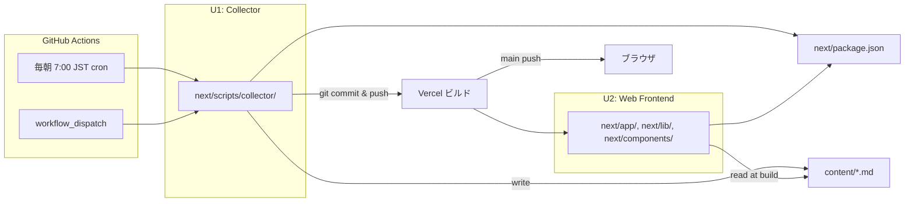

# Unit of Work — Dependency Matrix

**Project**: news.hako.tokyo
**Stage**: INCEPTION — Units Generation
**Depth**: Minimal

ユニット間 (および共有資源との) 依存関係を明示します。

---

## 1. Unit Dependency Matrix

行 = 依存元、列 = 依存先 (`✓` = 依存あり、`-` = なし)

| from \\ to | U1 (Collector) | U2 (Web) | Article 型 | SourceConfig | content/ |
|---|---|---|---|---|---|
| **U1 (Collector)** | - | - | ✓ (型) | ✓ (設定) | ✓ **write** + read (重複検知用) |
| **U2 (Web)** | - | - | ✓ (型) | - | ✓ **read** (ビルド時) |
| **Article 型** | - | - | - | - | - |
| **SourceConfig** | - | - | - | - | - |
| **content/** | - | - | - | - | - |

---

## 2. ユニット間の直接依存

**U1 と U2 の間に直接的なコード依存はありません。** 両者は `<repo-root>/content/*.md` という **共有データ** および `next/lib/article.ts` の **共有型定義** のみを介して連携します。

### 2.1 U1 → U2 依存
- **コード依存**: なし
- **暗黙の依存**: U1 が出力する Markdown frontmatter スキーマが U2 の入力契約。スキーマ変更時は U2 側の `ArticleRepository` も同時更新が必要。

### 2.2 U2 → U1 依存
- **コード依存**: なし
- **暗黙の依存**: U2 が表示するフィールド構成 (Article 型) を U1 が満たすこと。

---

## 3. Cross-cutting 共有資源への依存

| 共有資源 | 物理パス | U1 依存 | U2 依存 | 変更時の影響 |
|---|---|---|---|---|
| `Article` 型 | `next/lib/article.ts` | ✓ (Adapter / Writer / Repository でインスタンス生成・直列化) | ✓ (Repository 戻り値、Page / Component の props) | **両ユニット要更新**。Construction の Code Generation で慎重にバージョン管理 |
| `SourceConfig` 型 | `next/config/sources.ts` (型 + 値) | ✓ (Runner / Adapter が値を読み込む) | - | U1 のみ影響 |
| `content/*.md` (Markdown) | `<repo-root>/content/` | ✓ (write + 重複検知 read) | ✓ (read at build) | スキーマ変更時は両ユニット要更新 |
| `HttpClient` / `FileSystem` 抽象 | `next/scripts/collector/lib/` (U1 内に閉じる予定) | ✓ | - (使わない) | U1 のみ影響 |

---

## 4. ビルド・実行依存



### Text Alternative
- GitHub Actions の cron / 手動トリガが U1 (Collector) を起動
- U1 と U2 はどちらも `next/package.json` の単一依存ツリーに依存 (Q4=A)
- U1 が `content/` に書き出し、git commit → push
- main push が Vercel ビルドをトリガ
- Vercel ビルド時に U2 が `content/` を読み込み静的 HTML を生成
- ブラウザが Vercel CDN 経由で閲覧

---

## 5. 実装順序 (Q2 = A により逐次)

```text
1. U1 Construction
   ├ Functional Design  (Article 型 / frontmatter スキーマ確定)
   ├ NFR Requirements
   ├ NFR Design         (PBT 適用設計)
   ├ Infrastructure Design (.github/workflows/collect.yml)
   └ Code Generation    (Article 型・全 Collector コンポーネント実装、初期 Markdown 生成)

2. U2 Construction      (U1 の出力 Markdown と確定型を読み込む)
   ├ Functional Design  (Repository / Page 詳細)
   ├ NFR Requirements
   ├ NFR Design
   ├ Infrastructure Design (Vercel + .github/workflows/ci.yml)
   └ Code Generation    (Page / Layout / Component / Repository 実装)

3. Build and Test       (両ユニット統合テスト、E2E)
```

### 開始ブロッカー
- **U2 開始時には U1 の Code Generation が完了している必要がある** (Article 型と Markdown スキーマが確定済み)
- U1 → U2 の引き渡し成果物:
  - `next/lib/article.ts` (Article 型)
  - `<repo-root>/content/*.md` (実 Markdown サンプル — 開発中の動作確認用)
  - frontmatter スキーマ仕様 (Functional Design 文書内)

---

## 6. ロールバック戦略

| 失敗ケース | ロールバック手段 |
|---|---|
| U1 の収集ジョブが本番で連続失敗 | `.github/workflows/collect.yml` を一時的に disable (workflow ファイルから cron を外す PR、または GitHub UI で disable)。**既存 `content/` は影響なし**。 |
| U1 の Adapter 実装にバグ (例: 不正な Markdown を生成) | 該当コミットを `git revert` し、再 deploy。`content/` の不正 Markdown ファイルを `git rm` で削除する PR を別途。 |
| U2 のビルドが失敗 | Vercel が前回成功ビルドを維持 (自動)。原因コミットを `git revert`。 |
| Article 型の互換性破壊 (frontmatter スキーマ変更) | 既存 `content/` 全体への影響を考慮。マイグレーションスクリプトを書くか、breaking change を宣言して `content/` を再構築する。MVP では発生させない方針。 |

---

## 7. 結合度・テスト戦略の確認

| 観点 | 評価 |
|---|---|
| ユニット間結合 | **データ結合のみ** (Markdown スキーマ)。コード依存ゼロ。 |
| デプロイ独立性 | **完全独立**。U1 を停止しても U2 は動き続ける (静的サイト) |
| テスト独立性 | **完全独立**。U1 のテストは fixtures の Markdown 生成、U2 のテストは fixtures の Markdown 読み込みで完結 |
| 共有型変更時の協調 | スキーマレビューを Functional Design (U1) で実施。型定義は **単一ソース** (`next/lib/article.ts`) で運用 |

---

## 8. PBT 適用範囲のユニット間整合

| PBT Rule | U1 適用箇所 | U2 適用箇所 | 重複回避 |
|---|---|---|---|
| PBT-02 (Round-trip) | `MarkdownWriter`: `Article → Markdown` の出力検証 | `ArticleRepository`: `Markdown → Article` の入力検証 | `Article → Markdown → Article === Article` の **完全ラウンドトリップテスト** は U1 と U2 をまたぐ統合テストとして Build and Test 段階で実装。U1 単体では出力スキーマ準拠、U2 単体では入力スキーマ準拠を検証。 |
| PBT-03 (Invariant) | `Deduplicator.filterNew` の URL 一意性、`SlugBuilder.build` の `[a-z0-9-]+` 制約 | (該当少) | — |
| PBT-07 (Generators) | `Article` / `RssItem` 等のジェネレータ定義 (`next/scripts/collector/test/generators/` 等) | U1 の generator を再利用 | 共通 fixture / generator は **U1 で先に定義し U2 でも import** |
| PBT-08 (Shrinking & Reproducibility) | seed ログ | seed ログ | CI 設定で統一 |
| PBT-09 (Framework Selection) | fast-check + Vitest | fast-check + Vitest | 共有 (Q4=A により単一 package.json) |
