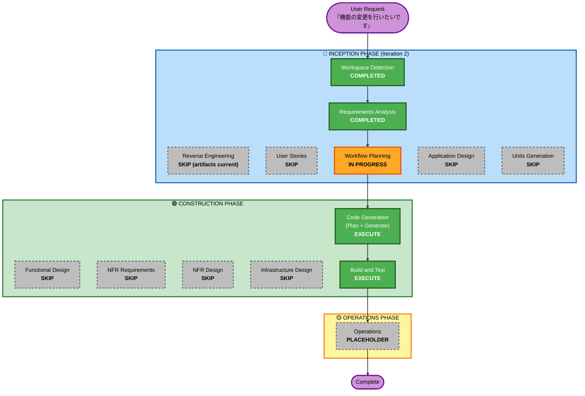

# Execution Plan — Iteration 2 (Feature Change)

**Workflow Iteration**: 2 (post-MVP)
**Created**: 2026-04-29
**Project Type**: Brownfield (post-MVP enhancement)
**Source Requirements**: `aidlc-docs/inception/requirements/requirements.md` Section 11

---

## 1. Detailed Analysis Summary

### 1.1 Transformation Scope (Brownfield)

- **Transformation Type**: **Single component scope** (small enhancement) — 既存 MVP の `next/` パッケージ内に閉じる
- **Primary Changes**:
  - `next/config/sources.ts`: 4 ソースの `maxItemsPerRun` を 10 に統一、はてブ URL を総合 (`hotentry.rss`) に変更
  - `next/lib/articles.ts` (または同一 lib 内に新規純粋関数): 公開日 3 日以内のフィルタ関数を追加
  - `next/app/page.tsx`: フィルタ関数の呼び出し挿入
  - 関連テスト: 既存 unit test の更新 + フィルタ関数の PBT-03 (不変条件) 追加
- **Related Components**: なし (新規パッケージ / 新規 CDK / 新規インフラなし)

### 1.2 Change Impact Assessment

| 観点 | 影響 | 詳細 |
|---|---|---|
| **User-facing changes** | Yes | 一覧に表示される記事数が大幅に減少 (収集件数 1/4.5 + 直近 3 日フィルタ) |
| **Structural changes** | No | アーキテクチャ変更なし。既存ファイル内のロジック追加のみ |
| **Data model changes** | No | `Article` / `ArticleFrontmatter` / Markdown スキーマは変更なし |
| **API changes** | No | 外部 API 提供なし。内部関数のシグネチャ変更も最小限 |
| **NFR impact** | Positive | 収集件数削減でビルド時間と Markdown 蓄積速度が改善 |

### 1.3 Component Relationships (Brownfield)

```
Primary Component:
  - next/config/sources.ts (設定)
  - next/lib/articles.ts (フィルタ関数追加)
  - next/app/page.tsx (フィルタ適用)

Supporting Components:
  - next/lib/articles.test.ts (unit test 更新)
  - next/lib/articles.pbt.test.ts (PBT-03 不変条件追加)
  - next/scripts/collector/* (設定値を読むだけ。コードは変更不要)

Dependent Components:
  - next/components/article-list.tsx (props は views のみ受け取るため変更不要)
  - next/components/header.tsx / footer.tsx (stats を受け取るため、stats 計算がフィルタ後配列ベースに変わるが既存実装で吸収)
```

| Related Component | Change Type | Change Reason | Priority |
|---|---|---|---|
| `next/config/sources.ts` | Configuration-only | 件数 / カテゴリ調整 | Critical |
| `next/lib/articles.ts` | Minor | 純粋関数追加とフィルタ呼び出し | Critical |
| `next/app/page.tsx` | Minor | フィルタ適用 | Critical |
| `next/lib/articles.test.ts` | Minor | テスト更新 | Important |
| `next/lib/articles.pbt.test.ts` | Minor | PBT-03 追加 | Important |
| Collector ソース (`next/scripts/collector/sources/*`) | None | 設定値を読むだけ | — |
| 表示コンポーネント (`article-list.tsx` 等) | None | props 変更なし | — |

### 1.4 Risk Assessment

- **Risk Level**: **Low**
  - 既存ファイル内の数値変更 + 純粋関数追加のみ
  - ロールバックは git revert で完結
  - 新規依存 / 新規インフラなし
  - 個人利用 / 単独ステークホルダー (NFR-01: 1 日数十アクセス未満)
- **Rollback Complexity**: **Easy** (commit を 1 つ revert すれば完了)
- **Testing Complexity**: **Simple** (Vitest unit + PBT 既存基盤を踏襲、E2E は既存シナリオ + 表示件数アサーションを微調整)

---

## 2. Workflow Visualization



### Text Alternative

```
🔵 INCEPTION PHASE (Iteration 2)
  ✅ Workspace Detection (COMPLETED)
  ⏭️ Reverse Engineering (SKIP — 既存成果物が現行と判定)
  ✅ Requirements Analysis (COMPLETED — 2026-04-29 承認済み)
  ⏭️ User Stories (SKIP — 個人利用 / 単独ステークホルダー / 小規模 Enhancement)
  🔄 Workflow Planning (IN PROGRESS)
  ⏭️ Application Design (SKIP — 新コンポーネントなし、既存ファイル修正のみ)
  ⏭️ Units Generation (SKIP — 単一作業単位で完結)

🟢 CONSTRUCTION PHASE
  ⏭️ Functional Design (SKIP — シンプルなフィルタ関数 + 設定値変更で詳細設計不要)
  ⏭️ NFR Requirements (SKIP — 既存 NFR を継承、新規 NFR なし)
  ⏭️ NFR Design (SKIP — NFR Requirements がスキップされるため)
  ⏭️ Infrastructure Design (SKIP — インフラ変更なし)
  ✅ Code Generation (EXECUTE — Plan + Generate)
  ✅ Build and Test (EXECUTE — 常に実行)

🟡 OPERATIONS PHASE
  ⏭️ Operations (PLACEHOLDER — Iteration 1 と同じ)
```

---

## 3. Phases to Execute

### 🔵 INCEPTION PHASE
- [x] Workspace Detection (COMPLETED — 2026-04-29)
- [x] Reverse Engineering (SKIPPED — 既存成果物が現行コードベースと整合)
- [x] Requirements Analysis (COMPLETED — 2026-04-29、Section 11 承認済み)
- [x] User Stories (SKIPPED)
  - **Rationale**: 個人利用 / 単独ステークホルダー / 小規模 Enhancement の継続。Iteration 1 と同じ判定。
- [x] Workflow Planning (IN PROGRESS — 本ドキュメント)
- [ ] Application Design — **SKIP**
  - **Rationale**: 新コンポーネント / 新サービス / 新インターフェース不要。既存 `next/lib/articles.ts` への純粋関数追加と `next/config/sources.ts` の値変更のみ。
- [ ] Units Generation — **SKIP**
  - **Rationale**: 全変更が `next/` パッケージ内の隣接ファイル群で完結し、単一作業単位として扱うことが自然。ユニット分解で得る並列性 / 構造的整理のメリットが、変更規模に対して過剰。

### 🟢 CONSTRUCTION PHASE (Single Logical Unit: `iteration-2-feature-change`)
- [ ] Functional Design — **SKIP**
  - **Rationale**: 業務ルールの新規導入なし。フィルタロジックは「`publishedAt ≥ now - 3 days`」というワンライナー判定で、要件ドキュメント (FR-NEW-01) に詳細設計レベルの仕様が既に記載済み。
- [ ] NFR Requirements — **SKIP**
  - **Rationale**: NFR-01 〜 NFR-08 はすべて Iteration 1 から継承。新規 NFR なし、技術スタック変更なし。
- [ ] NFR Design — **SKIP**
  - **Rationale**: NFR Requirements が SKIP のため。
- [ ] Infrastructure Design — **SKIP**
  - **Rationale**: GitHub Actions / Vercel / npm の構成は無変更。インフラリソースの追加なし。
- [ ] **Code Generation** — **EXECUTE** (ALWAYS、Part 1 Plan + Part 2 Generate)
  - **Rationale**: 実装が必要。Plan で詳細手順 (チェックボックス付き) を確定してから Generate に進む。
- [ ] **Build and Test** — **EXECUTE** (ALWAYS)
  - **Rationale**: typecheck / lint / unit / E2E / ビルドのフルセット検証が必要。AC-11 〜 AC-16 を網羅する受入確認も実施。

### 🟡 OPERATIONS PHASE
- [ ] Operations — **PLACEHOLDER** (Iteration 1 と同じく将来拡張用)

---

## 4. Package Change Sequence

単一パッケージ (`next/`) 内の隣接ファイルのみのため **完全逐次** で実装する:

| 順 | ファイル | 変更内容 | 依存 |
|---|---|---|---|
| 1 | `next/config/sources.ts` | 4 ソースの `maxItemsPerRun=10`、はてブ URL を総合に変更 | なし |
| 2 | `next/lib/articles.ts` | フィルタ純粋関数 `filterArticlesWithinDays(articles, days, now)` を追加 | なし |
| 3 | `next/app/page.tsx` | `articleRepository.getAllArticles()` の結果に `filterArticlesWithinDays` を適用 | step 2 |
| 4 | `next/lib/articles.test.ts` | フィルタ関数のユニットテスト追加 | step 2 |
| 5 | `next/lib/articles.pbt.test.ts` | フィルタ関数の PBT-03 不変条件追加 | step 2 |
| 6 | `next/e2e/*.spec.ts` (必要なら) | 既存 E2E の表示件数前提を更新 | step 1〜3 |

---

## 5. Estimated Timeline

| 項目 | 見積 |
|---|---|
| Code Generation Part 1 (Plan) | 5〜10 分 |
| Code Generation Part 2 (Generate) | 30〜60 分 (テスト含む) |
| Build and Test | 5〜10 分 (typecheck + lint + unit + E2E + build) |
| **合計** | **約 1 時間以内** |

緊急度 Q8=B (1〜3 日以内) に対し十分余裕を持って完了可能。

---

## 6. Success Criteria

### Primary Goal
表示が見づらい / 情報過多 (Q6=A) を解消するため、記事収集件数と表示対象を縮小する Enhancement を完成させる。

### Key Deliverables
- `next/config/sources.ts`: 4 ソースとも `maxItemsPerRun=10`、はてブ URL を総合化
- `next/lib/articles.ts`: 公開日 3 日以内のフィルタ関数 + 既存 sortArticlesForDisplay との合成
- `next/app/page.tsx`: フィルタ適用済みの一覧表示
- 既存 76 unit/PBT テストが緑のまま、新規フィルタ関数のテストが追加され緑

### Quality Gates
- `npm run lint` / `npx tsc --noEmit` / `npm run test:run` / `npm run build` がすべて成功
- AC-11 〜 AC-16 を満たす実装
- PBT-03 (フィルタ不変条件) が CI で seed ログ付きで実行
- gitleaks スキャン緑

### Integration Testing
- E2E (Playwright): 一覧ページが「直近 3 日 + 上位 10 件 × 4 ソース上限」の制約下で正しく表示される

### Operational Readiness
- 既存 GitHub Actions ワークフロー (collect / ci) が無変更で動作継続
- Vercel デプロイは main push トリガで自動再ビルド
- AC-12 (はてブ総合カテゴリ化) は次回 collect ジョブ実行で実証

---

## 7. Out of Scope (Iteration 2)

- フィルタ閾値 (3 日) のユーザー設定化 / 環境変数化
- カテゴリ別 / ソース別の表示絞り込み UI
- 過去記事の検索 / アーカイブページ
- 見た目の刷新 (CSS / レイアウト)
- ソース追加 (Zenn トピック別フィード等)
- `content/` の物理削除 / アーカイブ機構

---

## 8. Coordination Plan

| Module | Update Approach |
|---|---|
| `next/` (single package) | **Sequential (完全逐次)** — 単一パッケージで競合なし |
| Critical Path | `sources.ts` → `articles.ts` → `page.tsx` → tests |
| Testing Checkpoints | (a) ファイル単位修正後に `tsc --noEmit`、(b) 全変更後に `vitest run`、(c) 最後に `next build` + `playwright test` |
| Rollback | 単一 commit を git revert すれば全変更が巻き戻る |

---

## 9. Approval Required

このプランで Code Generation に進んで問題ないかを確認してください。
