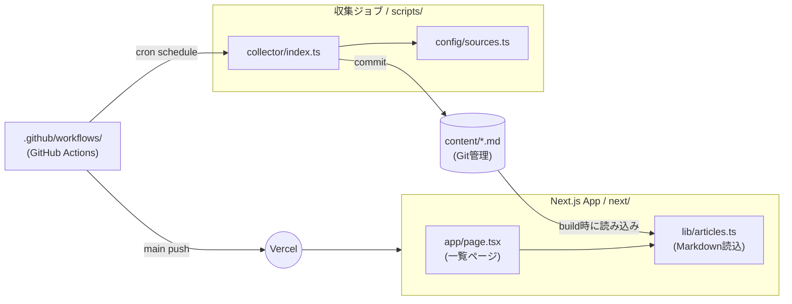

# Execution Plan — news.hako.tokyo

**Owner**: umatoma さん (個人利用)
**Created**: 2026-04-25
**Source**: `aidlc-docs/inception/requirements/requirements.md` 等の先行成果物

---

## 1. Detailed Analysis Summary

### 1.1 Transformation Scope (Brownfield)
- **Transformation Type**: Single Component (単一の Next.js アプリ + GitHub Actions の収集ジョブを新設)
- **Primary Changes**:
  - `next/` 配下の Next.js アプリに **ニュース一覧ページ実装** + **Markdown 取り込みロジック** を追加
  - リポジトリルートに **GitHub Actions ワークフロー** (収集ジョブ + CI) を新設
  - リポジトリルートに **収集スクリプト** および **収集対象設定ファイル** を新設
- **Related Components**:
  - `next/app/page.tsx` (置き換え)
  - `next/app/layout.tsx` (タイトル等のメタデータ調整)
  - 新規: `next/lib/articles.ts` (Markdown 読み込み・型定義)
  - 新規: `scripts/collector/` (収集ジョブのコード)
  - 新規: `config/sources.ts` (収集対象設定)
  - 新規: `content/` (収集済み Markdown 格納)
  - 新規: `.github/workflows/` (CI + 収集ジョブ)
  - 新規: `vercel.json` (必要に応じてデプロイ設定)

### 1.2 Change Impact Assessment
| 領域 | 影響 | 説明 |
|---|---|---|
| User-facing | Yes | 一覧ページが新規実装される (現状はテンプレート画面)。ただし観客は本人のみ。 |
| Structural | Yes | プロジェクトルートに `scripts/`, `config/`, `content/`, `.github/workflows/` が増える。 |
| Data Model | Yes | 記事の Markdown スキーマ (frontmatter フォーマット) と TypeScript 型を新設。 |
| API | No | 公開 API は提供しない。内部関数群 (`getAllArticles()` 等) のみ。 |
| NFR | Yes | テスト基盤 (Vitest + fast-check + Playwright)、CI/CD、PBT Partial の運用ルールが追加される。 |

### 1.3 Component Relationships (Brownfield)



#### Text Alternative
- `next/app/page.tsx` は `next/lib/articles.ts` 経由で `content/*.md` を読み込み、一覧 HTML を生成
- `scripts/collector/index.ts` は `config/sources.ts` を参照し、外部から記事取得 → `content/*.md` を新規コミット
- `.github/workflows/` の cron が `scripts/collector` を起動し、main ブランチに push
- main への push が Vercel の自動デプロイをトリガする

| Component | Change Type | Reason | Priority |
|---|---|---|---|
| `next/app/page.tsx` | Major | 一覧画面実装 | Critical |
| `next/app/layout.tsx` | Minor | タイトル変更 | Important |
| `next/lib/articles.ts` (new) | Major (新規) | データ読込層 | Critical |
| `scripts/collector/` (new) | Major (新規) | 収集ジョブ本体 | Critical |
| `config/sources.ts` (new) | Major (新規) | 収集対象設定 | Critical |
| `content/` (new directory) | Major (新規) | 記事ストレージ | Critical |
| `.github/workflows/ci.yml` (new) | Major (新規) | CI パイプライン | Critical |
| `.github/workflows/collect.yml` (new) | Major (新規) | 収集ジョブの cron | Critical |
| `vercel.json` (new) | Optional | Vercel カスタム設定 | Optional |

### 1.4 Risk Assessment
- **Risk Level**: **Low — Medium**
  - Vercel + GitHub Actions のサーバレス構成のため、ロールバックは Git revert + 再デプロイで容易。
  - 中程度の不確定要素は **Togetter スクレイピング** (RISK-01) と **Next.js 16 の新仕様** (`next/AGENTS.md`)。
- **Rollback Complexity**: **Easy** (静的サイトであり、デプロイは Vercel が自動で履歴管理。`git revert` で過去ビルドに戻せる)
- **Testing Complexity**: **Moderate** (E2E (Playwright)、PBT (fast-check Partial)、外部ソース取得モックの整備が必要)

---

## 2. Workflow Visualization

```mermaid
flowchart TD
    Start(["User Request"])

    subgraph INCEPTION["🔵 INCEPTION PHASE"]
        WD["Workspace Detection<br/><b>COMPLETED</b>"]
        RE["Reverse Engineering<br/><b>COMPLETED</b>"]
        RA["Requirements Analysis<br/><b>COMPLETED</b>"]
        US["User Stories<br/><b>SKIP</b>"]
        WP["Workflow Planning<br/><b>IN PROGRESS</b>"]
        AD["Application Design<br/><b>EXECUTE</b>"]
        UG["Units Generation<br/><b>EXECUTE</b>"]
    end

    subgraph CONSTRUCTION["🟢 CONSTRUCTION PHASE"]
        FD["Functional Design<br/>(per-unit)<br/><b>EXECUTE</b>"]
        NFRA["NFR Requirements<br/>(per-unit)<br/><b>EXECUTE</b>"]
        NFRD["NFR Design<br/>(per-unit)<br/><b>EXECUTE</b>"]
        ID["Infrastructure Design<br/>(per-unit, minimal)<br/><b>EXECUTE</b>"]
        CG["Code Generation<br/>(per-unit, Plan + Generate)<br/><b>EXECUTE</b>"]
        BT["Build and Test<br/><b>EXECUTE</b>"]
    end

    subgraph OPERATIONS["🟡 OPERATIONS PHASE"]
        OPS["Operations<br/><b>PLACEHOLDER</b>"]
    end

    Start --> WD
    WD --> RE
    RE --> RA
    RA --> WP
    RA -.skipped.-> US
    WP --> AD
    AD --> UG
    UG --> FD
    FD --> NFRA
    NFRA --> NFRD
    NFRD --> ID
    ID --> CG
    CG -.->|Next Unit| FD
    CG --> BT
    BT -.-> OPS
    BT --> End(["Complete"])

    style WD fill:#4CAF50,stroke:#1B5E20,stroke-width:3px,color:#fff
    style RE fill:#4CAF50,stroke:#1B5E20,stroke-width:3px,color:#fff
    style RA fill:#4CAF50,stroke:#1B5E20,stroke-width:3px,color:#fff
    style WP fill:#4CAF50,stroke:#1B5E20,stroke-width:3px,color:#fff
    style US fill:#BDBDBD,stroke:#424242,stroke-width:2px,stroke-dasharray: 5 5,color:#000
    style AD fill:#FFA726,stroke:#E65100,stroke-width:3px,stroke-dasharray: 5 5,color:#000
    style UG fill:#FFA726,stroke:#E65100,stroke-width:3px,stroke-dasharray: 5 5,color:#000
    style FD fill:#FFA726,stroke:#E65100,stroke-width:3px,stroke-dasharray: 5 5,color:#000
    style NFRA fill:#FFA726,stroke:#E65100,stroke-width:3px,stroke-dasharray: 5 5,color:#000
    style NFRD fill:#FFA726,stroke:#E65100,stroke-width:3px,stroke-dasharray: 5 5,color:#000
    style ID fill:#FFA726,stroke:#E65100,stroke-width:3px,stroke-dasharray: 5 5,color:#000
    style CG fill:#4CAF50,stroke:#1B5E20,stroke-width:3px,color:#fff
    style BT fill:#4CAF50,stroke:#1B5E20,stroke-width:3px,color:#fff
    style OPS fill:#BDBDBD,stroke:#424242,stroke-width:2px,stroke-dasharray: 5 5,color:#000
    style INCEPTION fill:#BBDEFB,stroke:#1565C0,stroke-width:3px,color:#000
    style CONSTRUCTION fill:#C8E6C9,stroke:#2E7D32,stroke-width:3px,color:#000
    style OPERATIONS fill:#FFF59D,stroke:#F57F17,stroke-width:3px,color:#000
    style Start fill:#CE93D8,stroke:#6A1B9A,stroke-width:3px,color:#000
    style End fill:#CE93D8,stroke:#6A1B9A,stroke-width:3px,color:#000

    linkStyle default stroke:#333,stroke-width:2px
```



### Text Alternative (Mermaid 失敗時の代替)

```text
INCEPTION フェーズ:
  Workspace Detection (COMPLETED)
  → Reverse Engineering (COMPLETED)
  → Requirements Analysis (COMPLETED)
  → User Stories (SKIP)
  → Workflow Planning (IN PROGRESS) ← 今ここ
  → Application Design (EXECUTE, minimal/standard)
  → Units Generation (EXECUTE, minimal — 2 ユニット想定)

CONSTRUCTION フェーズ (各ユニットでループ):
  Unit 1: Collector (収集ジョブ)
    Functional Design (EXECUTE)
    → NFR Requirements (EXECUTE)
    → NFR Design (EXECUTE)
    → Infrastructure Design (EXECUTE, minimal)
    → Code Generation (EXECUTE)
  Unit 2: Web Frontend (一覧表示)
    Functional Design (EXECUTE)
    → NFR Requirements (EXECUTE)
    → NFR Design (EXECUTE)
    → Infrastructure Design (EXECUTE, minimal)
    → Code Generation (EXECUTE)

  Build and Test (EXECUTE)

OPERATIONS フェーズ:
  Operations (PLACEHOLDER) — 将来拡張のためのプレースホルダー
```

---

## 3. Phases to Execute

### 🔵 INCEPTION PHASE
- [x] Workspace Detection — **COMPLETED** (2026-04-25)
- [x] Reverse Engineering — **COMPLETED** (2026-04-25)
- [x] Requirements Analysis — **COMPLETED** (2026-04-25)
- [x] User Stories — **SKIP**
  - **Rationale**: 個人利用 (Q2=A, Q6=A)、単独ステークホルダー、機能スコープが「一覧表示 + 収集ジョブ」のみで明確。ペルソナ定義の意義が薄く、要件で AC-01〜AC-10 が網羅されている。
- [ ] Workflow Planning — **IN PROGRESS** (本ドキュメント)
- [ ] Application Design — **EXECUTE** (depth: standard)
  - **Rationale**: 新規コンポーネント (`articles` データ層、`collector` 収集ジョブ、`sources` 設定) と各メソッド・型を明確にすることで、後続のコード生成が安定する。
- [ ] Units Generation — **EXECUTE** (depth: minimal)
  - **Rationale**: 「Collector (収集ジョブ)」と「Web Frontend (一覧表示)」の 2 ユニットに分解することで、Construction フェーズを per-unit ループで効率的に進められる。両者は独立に開発・テスト可能。

### 🟢 CONSTRUCTION PHASE (per-unit loop, 2 units)

| Stage | 判定 | Rationale |
|---|---|---|
| Functional Design | **EXECUTE** (per-unit) | 各ユニットに新規データモデル (Article 型、frontmatter スキーマ) と業務ロジック (取得 → 正規化 → 重複排除 → 保存、Markdown → 一覧描画) があるため。 |
| NFR Requirements | **EXECUTE** (per-unit) | テストフレームワーク選定 (PBT-09 の検証)、収集ジョブの実行時間枠、Vercel ビルド時間制約等の確認が必要。 |
| NFR Design | **EXECUTE** (per-unit) | PBT Partial (PBT-02, 03, 07, 08, 09) のパターンを各ユニットの設計に組み込むため。 |
| Infrastructure Design | **EXECUTE** (per-unit, minimal) | Vercel 設定 + GitHub Actions ワークフロー (cron + CI) の最小限の仕様化。完全省略は危険 (cron 時刻、Secrets、permissions 等の確認漏れリスク)。 |
| Code Generation | **EXECUTE** (per-unit, ALWAYS) | Part 1 (Plan) + Part 2 (Generate) をユニット毎に実行。 |
| Build and Test | **EXECUTE** (ALWAYS, post-units) | 全ユニット完了後の統合ビルド・テスト・E2E。 |

### 🟡 OPERATIONS PHASE
- [ ] Operations — **PLACEHOLDER** (将来拡張用)

---

## 4. Tentative Units of Work (詳細は Units Generation で確定)

| Unit ID | Unit Name | Scope | Depends On |
|---|---|---|---|
| U1 | **Collector** (収集ジョブ) | RSS パース (Zenn / Hatena / Google ニュース)、Togetter スクレイピング、重複排除、Markdown 書き出し、設定 (`config/sources.ts`)、共通型 (`Article`) | — |
| U2 | **Web Frontend** (一覧表示) | Markdown 読み込み (`lib/articles.ts`)、一覧ページ (`app/page.tsx`) 改修、レイアウト (`app/layout.tsx`) のメタデータ更新、CSS 調整 | U1 (の出力 Markdown 形式が確定後)。ただしモック Markdown でも開発可能。 |

**Update Approach**: **Sequential** — U1 → U2 (Markdown スキーマが先に確定するため)
**Critical Path**: U1 (型定義および Markdown フォーマットを定めた段階で U2 を並列着手可能)
**Testing Checkpoints**: 各ユニットごとに Code Generation 内で単体テストを通す。Build and Test で全体統合確認。
**Rollback Strategy**: ユニット完了ごとに Git コミット。問題があれば該当コミットを `git revert`。Vercel が前回成功ビルドにフォールバック可能。

---

## 5. Compliance Summary

### 5.1 Security Baseline (拡張機能 = 無効)
- 全 SECURITY ルール: **N/A** (ユーザーオプトアウト Q18=B)
- 個別配慮 (要件で残した最低限): API キーの secrets 管理、`gitleaks` / `npm audit` を CI で実行 — Construction フェーズで配慮する。

### 5.2 PBT (Partial — PBT-02, 03, 07, 08, 09)
- **PBT-09 (Framework Selection)**: ✅ 準拠 — Vitest + fast-check を要件 NFR-04 / 技術前提 / 本実行計画にて明記。
- **PBT-01 (Property Identification)**: 部分モードでは非強制だが、Functional Design で各ユニットの「Testable Properties」セクションを推奨 (advisory)。
- **PBT-02, 03, 07, 08**: Code Generation・Build and Test 段階で評価対象。
- **PBT-04, 05, 06, 10**: Partial モードでは N/A (advisory)。

---

## 6. Estimated Timeline

| ステージ | 想定期間 |
|---|---|
| Application Design + Units Generation (残り Inception) | 0.5 〜 1 日 |
| Unit 1: Collector — Functional Design 〜 Code Generation | 3 〜 4 日 |
| Unit 2: Web Frontend — Functional Design 〜 Code Generation | 2 〜 3 日 |
| Build and Test | 1 〜 2 日 |
| バッファ (Togetter 利用規約確認、Next.js 16 仕様確認等) | 1 〜 2 日 |
| **合計** | **概ね 1.5 〜 2 週間** (要件 NFR-06 の目標 1〜2 週間と整合) |

---

## 7. Success Criteria

- **Primary Goal**: AC-01〜AC-10 (要件ドキュメント受入基準) をすべて満たす MVP のリリース。
- **Key Deliverables**:
  - `next/` 配下の更新済み Next.js アプリ (一覧ページ + Markdown 読み込み層)
  - `scripts/collector/` 配下の収集ジョブ
  - `config/sources.ts` の収集対象設定
  - `content/` の収集済み Markdown 群 (初回実行分)
  - `.github/workflows/` の CI + cron ワークフロー
  - Vercel 自動デプロイの稼働確認
  - Vitest + fast-check (PBT) + Playwright のテスト一式
- **Quality Gates**:
  - GitHub Actions CI で lint + typecheck + unit + E2E がすべて緑
  - PBT (PBT-02, 03, 07, 08, 09) が CI で実行され seed が記録される
  - Togetter 利用規約と robots.txt の確認済み (Construction 開始前)
  - `gitleaks` / `npm audit` で重大な指摘なし
  - Vercel 上で本番 URL が表示される

---

## 8. Open Questions (Construction で解消予定)

| 番号 | 内容 | 解決ステージ |
|---|---|---|
| OQ-01 | Togetter スクレイピングは利用規約・robots.txt 上問題ないか? 不可なら代替か除外 | NFR Requirements (Unit 1) |
| OQ-02 | ~~一般ニュースは NewsAPI か個別 RSS か (具体的なソース選定)~~ | **解消済み** (Google ニュース 非公式 RSS で確定。Functional Design では具体的なクエリ / トピック / 地理パラメータを決定) |
| OQ-03 | Vercel デプロイのプレビュー URL を E2E でどう取り回すか | Infrastructure Design (Unit 2) または Build and Test |
| OQ-04 | Markdown frontmatter のスキーマ詳細 (date 形式、tags フィールド有無) | Functional Design (Unit 1) |
| OQ-05 | Next.js 16 の breaking changes が `app/page.tsx` の Markdown 読み込みに影響するか | Functional Design (Unit 2)。`node_modules/next/dist/docs/` を必ず参照 |

---

## 9. Plan Tracking Checklist

- [x] Step 1: Load all prior context (RE artifacts + requirements)
- [x] Step 2: Detailed scope and impact analysis
- [x] Step 3: Phase determination (per-stage rationale)
- [x] Step 4: Adaptive depth note
- [x] Step 5: Multi-module coordination analysis
- [x] Step 6: Workflow visualization (Mermaid + text alternative)
- [x] Step 7: Execution plan document created (this file)
- [ ] Step 8: aidlc-state.md initialization
- [ ] Step 9: Present plan to user (awaiting approval)
- [ ] Step 10: Handle user response
- [ ] Step 11: Log interaction
