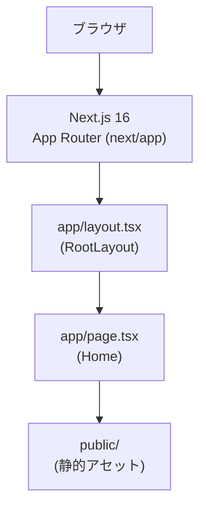
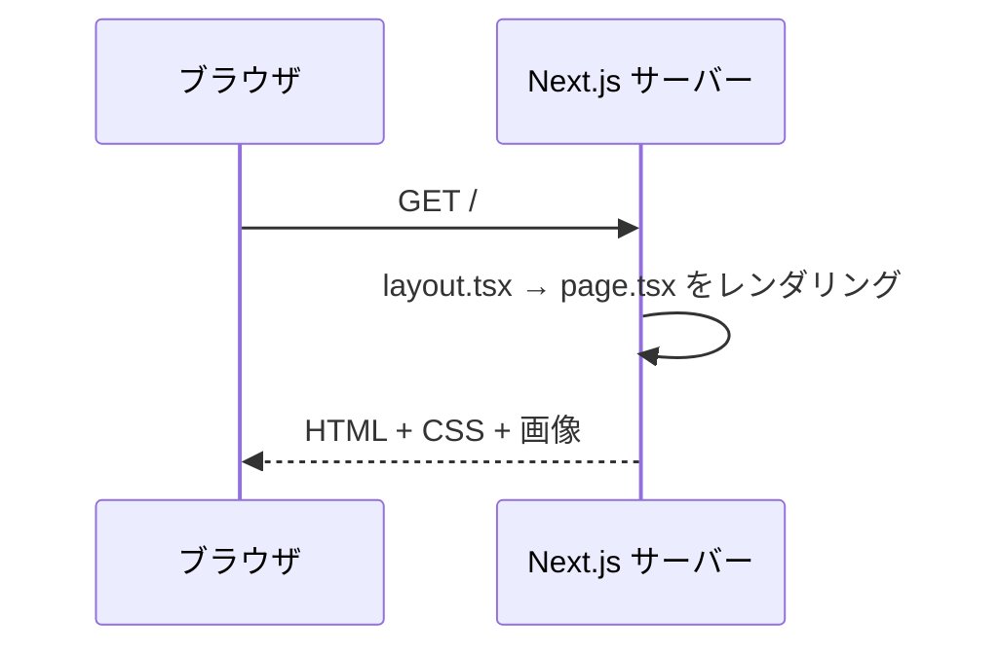

# System Architecture

## System Overview

`news.hako.tokyo` は単一の Next.js 16 アプリケーションで構成されたフロントエンド主体のスキャフォールドです。App Router (`next/app/`) を用いてルートページとレイアウトを定義しています。バックエンド API、永続化層、認証、外部統合は未実装です。

## Architecture Diagram

### Text Alternative
- ブラウザ → Next.js 16 App Router → RootLayout → Home (page.tsx) → public/ 静的アセット

## Component Descriptions

### `next/app/layout.tsx` (RootLayout)
- **Purpose**: アプリ全体の HTML 骨格とフォント、グローバル CSS の取り込みを行う。
- **Responsibilities**: `lang="en"` の `<html>` を出力、Geist Sans/Mono のフォント変数を適用、`<body>` に `min-h-full flex flex-col` を付与。
- **Dependencies**: `next/font/google` (Geist, Geist_Mono)、`./globals.css`。
- **Type**: Application

### `next/app/page.tsx` (Home)
- **Purpose**: ルート URL `/` のランディングページ。
- **Responsibilities**: Next.js のデフォルトテンプレート (Logo, "Deploy Now"/"Documentation" リンク) を表示するのみ。
- **Dependencies**: `next/image`。
- **Type**: Application

### `next/app/globals.css`
- **Purpose**: Tailwind CSS のグローバルエントリ。
- **Type**: Application

### `next/public/`
- **Purpose**: SVG 等の静的アセット格納。
- **Type**: Application

## Data Flow

### Text Alternative
- ブラウザ → GET / → Next.js サーバーが layout → page をレンダリング → HTML 応答

## Integration Points
- **External APIs**: なし
- **Databases**: なし
- **Third-party Services**: なし (デプロイ先候補として Vercel が想定されているが未設定)

## Infrastructure Components
- **CDK Stacks**: なし
- **Deployment Model**: 未定 (Vercel デプロイが Next.js テンプレートで示唆されているが、`next.config.ts` / CI 設定は未整備)
- **Networking**: 未定
