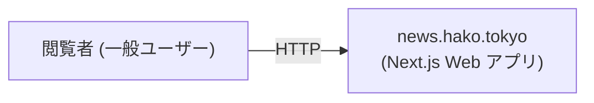

# Business Overview

## Business Context Diagram

### Text Alternative
- 閲覧者 (一般ユーザー) → HTTP → news.hako.tokyo (Next.js Web アプリ)

## Business Description

- **Business Description**: 現状のコードベースは `npx create-next-app` 直後のスキャフォールドのみで、業務領域に固有の処理は未実装です。プロジェクト名 `news.hako.tokyo` および GitHub リポジトリの状況から、ニュース系のWebサイトを構築する意図が推察されますが、確定したビジネス要件はまだ存在しません。
- **Business Transactions**: 現時点では未定義。スキャフォールドが提供する単一の静的ランディングページ表示のみ。
- **Business Dictionary**: 現時点では未定義。

## Component Level Business Descriptions

### `next/` (Next.js アプリケーションルート)
- **Purpose**: Next.js App Router を用いた Web フロントエンドのスキャフォールド。
- **Responsibilities**:
  - ルート URL `/` でデフォルトのランディングページ (Vercel/Next.js 紹介リンク) を表示する。
  - ルートレイアウト (HTML 骨格、Geist フォント、Tailwind 統合) の提供。

> **メモ**: 業務的な責務は現時点では未確定です。要件分析フェーズで、本プロダクトとして目指す業務 (ニュース集約、配信、編集ワークフロー等) を明確化する必要があります。
