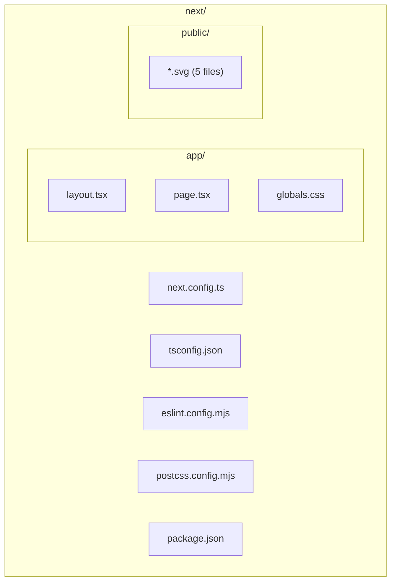

# Code Structure

## Build System
- **Type**: npm (package.json)
- **Configuration**:
  - `next/package.json` — 依存関係とスクリプト。
    - scripts: `dev`, `build`, `start`, `lint` (いずれも `next` CLI ベース)。
  - `next/next.config.ts` — Next.js 設定 (現時点ではオプションなし)。
  - `next/tsconfig.json` — TypeScript 設定 (`strict: true`、`paths: { "@/*": ["./*"] }`、`bundler` 解決)。
  - `next/eslint.config.mjs` — ESLint v9 Flat Config (`eslint-config-next/core-web-vitals` + `typescript`)。
  - `next/postcss.config.mjs` — Tailwind v4 用 PostCSS 設定。
  - `.nvmrc` — Node.js v24.13.1 指定。

## Key Modules

### Text Alternative
- `next/` 配下に `app/` (layout.tsx, page.tsx, globals.css) と `public/` (svg アセット群)、ルート設定ファイル群 (next.config.ts, tsconfig.json, eslint.config.mjs, postcss.config.mjs, package.json) が配置されている。

### Existing Files Inventory

- `next/app/layout.tsx` — RootLayout コンポーネント。Geist フォント適用、グローバル CSS 取り込み、`<html>`/`<body>` の骨格を提供。
- `next/app/page.tsx` — Home コンポーネント。Next.js のデフォルトランディング UI。
- `next/app/globals.css` — Tailwind CSS グローバル定義。
- `next/app/favicon.ico` — favicon。
- `next/public/file.svg` / `globe.svg` / `next.svg` / `vercel.svg` / `window.svg` — 静的 SVG アセット。
- `next/next.config.ts` — Next.js 設定 (空)。
- `next/tsconfig.json` — TypeScript 設定。
- `next/eslint.config.mjs` — ESLint Flat Config。
- `next/postcss.config.mjs` — PostCSS + Tailwind v4 設定。
- `next/next-env.d.ts` — Next.js 型補完 (自動生成)。
- `next/package.json` / `next/package-lock.json` — 依存定義 / ロック。
- `next/AGENTS.md` / `next/CLAUDE.md` — Next.js 16 がトレーニング後の breaking changes を含むことを LLM に通知するメモ。
- `next/README.md` — create-next-app デフォルト README。
- `.nvmrc` — Node v24.13.1。
- `.gitignore` — Git 除外設定。
- `CLAUDE.md` (ルート) — AI-DLC ワークフロー指示書。
- `.aidlc-rule-details/` — AI-DLC ルール詳細。

## Design Patterns

現時点ではドメイン固有のパターンは存在しません。Next.js の標準パターンのみが採用されています。

### Next.js App Router
- **Location**: `next/app/`
- **Purpose**: ルーティングとレンダリングを App Router 方式で行う。
- **Implementation**: `layout.tsx` がルートレイアウト、`page.tsx` が `/` のページコンポーネント。

### Server Components (default)
- **Location**: `next/app/layout.tsx`, `next/app/page.tsx`
- **Purpose**: デフォルトでサーバーコンポーネントとしてレンダリングし、クライアント JS を最小化。
- **Implementation**: `"use client"` ディレクティブが無いため、すべてサーバーコンポーネント。

## Critical Dependencies

### next
- **Version**: 16.2.4
- **Usage**: Web フレームワーク (App Router、画像最適化、フォント最適化、SSR)。
- **Purpose**: アプリケーションの基盤。

### react / react-dom
- **Version**: 19.2.4
- **Usage**: UI レイヤ。
- **Purpose**: コンポーネントレンダリング。

### tailwindcss / @tailwindcss/postcss
- **Version**: ^4
- **Usage**: スタイリング。
- **Purpose**: ユーティリティファースト CSS。

### typescript
- **Version**: ^5
- **Usage**: 全 TypeScript ソース。
- **Purpose**: 型安全。

### eslint / eslint-config-next
- **Version**: ^9 / 16.2.4
- **Usage**: 静的解析。
- **Purpose**: コード品質。

> **注意 (next/AGENTS.md より)**: Next.js 16 は破壊的変更を含む可能性があるため、コード作成前に `node_modules/next/dist/docs/` を参照することが推奨されている。
