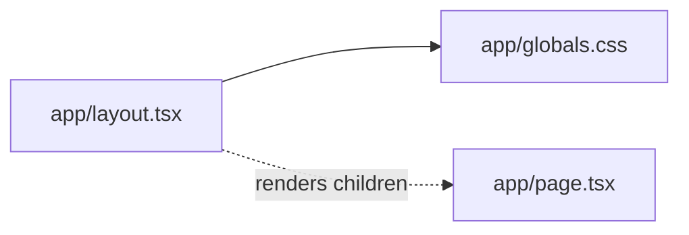

# Dependencies

## Internal Dependencies

### Text Alternative
- `app/layout.tsx` は `app/globals.css` を import。
- `app/layout.tsx` は子ルート (`app/page.tsx`) を `children` 経由で描画。

単一パッケージ構成のため、パッケージ間依存は存在しません。

## External Dependencies

### `next`
- **Version**: 16.2.4
- **Purpose**: Web フレームワーク。
- **License**: MIT

### `react`
- **Version**: 19.2.4
- **Purpose**: UI ライブラリ。
- **License**: MIT

### `react-dom`
- **Version**: 19.2.4
- **Purpose**: DOM レンダラ。
- **License**: MIT

### `typescript` (devDependency)
- **Version**: ^5
- **Purpose**: 型システム。
- **License**: Apache-2.0

### `@types/node` / `@types/react` / `@types/react-dom` (devDependency)
- **Version**: ^20 / ^19 / ^19
- **Purpose**: 型定義。
- **License**: MIT

### `tailwindcss` / `@tailwindcss/postcss` (devDependency)
- **Version**: ^4 / ^4
- **Purpose**: ユーティリティファースト CSS。
- **License**: MIT

### `eslint` / `eslint-config-next` (devDependency)
- **Version**: ^9 / 16.2.4
- **Purpose**: 静的解析。
- **License**: MIT
